# 谋马点评

## 一、技术栈

### 1、前端

1. 原生HTML、CSS、JS
2. Vue2（渐进式使用）
3. Element UI组件库
4. axios请求库

### 2、后端

**Spring相关：**

1. SpringBoot 2.x
2. SpringMVC

**数据存储层：**

1. MySQL：存储数据
2. MyBatis Plus：数据访问框架

**Redis相关：**

1. spring-data-redis：操作Redis
2. Redisson：基于Redis的分布式数据网格
3. Apache Commons Pool：用于实现Redis连接池

**工具库：**

1. HuTool：工具库合集
2. Lombok：注解式代码生成工具
3. Knife4j：接口文档

## 二、技术架构图

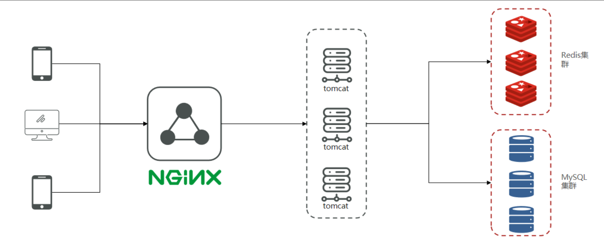

## 三、需求

- 密码登录 ✔
- 短信登录 ✔
- 用户登出 ✔
- 商户查询缓存 ✔
- 优惠券秒杀 ✔
- 达人探店 ✔
- 好友关注 ✔
- 附近的商户 ✔
- 用户签到 ✔
- UV统计 ✔
- 用户个人修改信息 ✔

## 四、功能实现

### 1、短信登录

#### 1）基于Session实现登录

1. 发送验证码

   1. 用户提交手机号
   2. 校验手机号是否合法
      1. 不合法，重新输入手机号
      2. 合法，生成验证码，保存验证码，然后通过短信的方式将验证码发送给客户

2. 短信验证码登录、注册

   1. 用户提交手机号和验证码
   2. 校验验证码
      1. 不一致，不通过，重新输入
      2. 验证码一致，根据手机号查询用户
         1. 用户信息不存在，则为用户创建账号信息，保存到数据库
      3. 将用户信息保存到session中

3. 校验登录状态

   用户在请求时，会从cookie中携带JsessionId到后台，后台通过JsessionId从session中拿到用户信息

   1. 如果没有session信息，则进行拦截
   2. 如果有session信息，则将用户信息保存到threadLocal中，并放行


#### 2）登录拦截器

> **tomcat运行原理**
>
> 
>
> 当用户发起请求时，会访问我们向tomcat注册的接口，任何程序想要运行，都需要有一个线程对当前端口号进行监听，tomcat也不例外，当监听线程知道用户想要和tomcat连接连接时，那会由监听线程创建socket连接，socket都是成对出现的，用户通过socket像互相传递数据，当tomcat端的socket接受到数据后，此时监听线程会从tomcat的线程池中取出一个线程执行用户请求，在我们的服务部署到tomcat后，线程会找到用户想要访问的工程，然后用这个线程转发到工程中的controller，service，dao中，并且访问对应的DB，在用户执行完请求后，再统一返回，再找到tomcat端的socket，再将数据写回到用户端的socket，完成请求和响应

=> 每个用户都是去找tomcat 线程池中的一个线程来完成工作的，使用完成后再进行回收。

独立请求 => 使用`threadlocal`做到线程隔离，每个线程操作自己的一份数据

> **threadlocal的知识**
>
> 在threadLocal中，无论是他的put方法还是get方法， 都是先从获得当前用户的线程，然后从线程中取出线程的成员变量map，只要线程不一样，map就不一样，所以可以通过这种方式来做到线程隔离


#### 3）用户信息脱敏

使用DTO对象返回给前端，略去用户敏感信息

#### 4）session共享问题

多台tomcat服务器带来的数据问题：

1. 每台服务器都必须拥有一份完成的session数据，服务器压力过大
2. 服务器之间可能出现数据不一致的现象

**解决方案**

使用一台机器存储数据，所有的服务器从这台机器上读取信息 => 使用Redis实现


#### 5）Redis代替session实现


**key结构设计**

由于Redis的key是共享的，设计key时必须满足：

- key的唯一性
- key要方便携带

**数据结构选择**

选择`Hash`结构


#### 6）解决状态刷新问题

起初的登录拦截器`LoginInterceptor`只是对部分路径进行拦截，同时刷新`token`的存活时间，这也就导致了它只能对它拦截的路径进行刷新`token`存活时间。假设当前用户访问了一些不需要拦截的路径，`token`就不会被刷新，这是存在问题的。

原始方案：

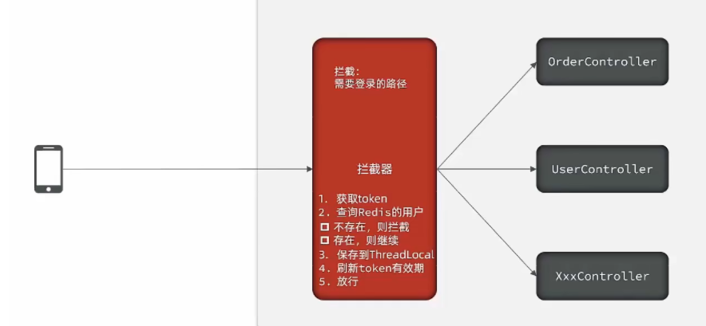

**解决方案**

添加一个优先级更高的拦截器，对所有路径进行拦截，把`LoginInterceptor`做的获取线程中的对象信息的操作设置到第一个拦截器中，同时刷新令牌。此时登录拦截器只需要从当前线程中获取对象信息，判断是否为空就可以判断用户是否登录，同时完成了整体刷新的功能。


### 2、密码登录

逻辑：

1. 用户输入手机号和密码
2. 校验手机号是否合法
   1. 不合法，重新输入手机号和密码
   2. 合法
      1. 取出密码，判空，加盐，加密算法得到加密后的密码
      2. 根据手机号查询数据库
      3. 校验数据库中的密码是否为空
      4. 不为空，进行密码比较
      5. 相同，保存用户登录态，返回结果
      6. 不相同，重新输入密码

注意点

1. 登录时根据手机号加锁，不能重复发送请求

### 3、用户登出

逻辑：

1. 判断用户是否登录
2. 未登录返回错误信息
3. 已登录移除登录态和redis中保存的key-value


### 4、商户查询缓存

> 添加Redis缓存、缓存更新策略、缓存穿透、缓存雪崩、缓存击穿

#### 1）什么是缓存

实际开发中，系统需要“避震器”，防止过高的数据访问猛冲系统，导致其操作线程无法及时处理信息而瘫痪，这种情况对于企业、用户来说都是致命的，所以企业非常重视缓存技术。

**缓存（cache）**，本质上就是数据交换的**缓冲区**，俗称的缓存就是**缓冲区中的数据**，一般读写性能较高。

缓存的**作用**：

- 降低后端负载。当用户进行请求时，先去查询缓存，若缓存命中，直接返回给用户，而不必查询数据库，大大降低了后端的压力。
- 提高读写效率，降低响应时间。数据库的读写是磁盘读写，IO流，响应事件长。而缓存通常是基于内存，读写时间快。

缓存的**成本**：

- 一致性成本。当数据库中的数据发生改变时，缓存中的数据还是旧的数据，这时需要考虑数据库和缓存数据一致的问题。
- 代码维护成本。为了解决一致性问题，以及缓存雪崩、缓存击穿等问题，代码开发、维护成本都会提高。
- 运维成本。缓存集群的部署和维护需要额外的人力成本、硬件成本。

**使用**缓存：

- 浏览器缓存：存在于浏览器端的缓存
- 应用层缓存：`map / redis`
- 数据库缓存：`buffer pool`
- CPU缓存：L1、L2、L3级缓存


#### 2）添加Redis缓存

**缓存作用模型**

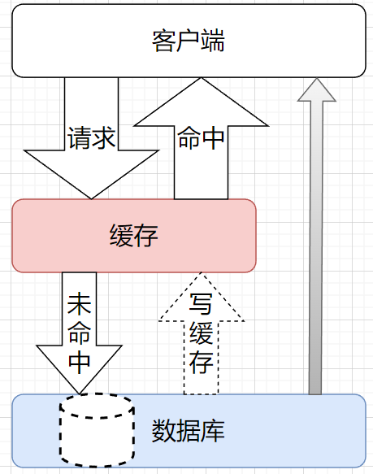

**根据id查询商铺信息**


**给店铺类型查询业务添加缓存**

店铺类型在首页和其他多个页面都会用到，可以使用缓存减少查询数据库压力。

实现逻辑：

1. 用户提交请求
2. 先查询缓存
3. 若缓存命中，直接返回
4. 若缓存未命中
   1. 查询数据库
   2. 写入缓存，并设置超时时间为1天
   3. 返回结果

#### 3）缓存更新策略

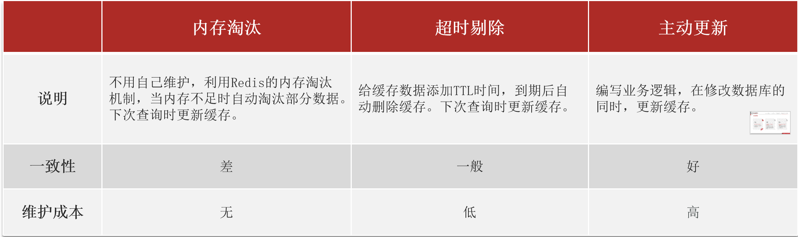

业务场景：

- 低一致性需求：使用内存淘汰机制，例如店铺类型的查询缓存
- 高一致性需求：主动更新，并且以超时删除作为兜底方案，例如店铺详情查询的缓存。

**主动更新策略**

- `Cache Aside Pattern`：由缓存的调用者，在更新数据库的同时更新缓存
- `Read/Write Through Pattern`：缓存与数据库作为一个服务，由服务来维护一致性，调用者调用该服务，无需关心缓存一直性问题
- `Write Behind Caching Pattern`：调用者只操作缓存，由其他县城异步的将缓存数据持久化到数据库，保证最终一致

> - `Read/Writer Through Pattern` 最大的问题是目前很难找到这样的服务。
> -  `Writer Behind Caching Pattern `的效率比较高，但是一致性难以保证，当缓存数据更新，还未开始异步更新数据库，如果此时 Redis 发生宕机，就会丢失数据。
> - `Cache Aside Pattern` 尽管需要自己编码，但其可控性更高，所以一般使用该种策略来进行缓存更新。

使用`Cache Aside Pattern`策略来操作缓存和数据库时有三个问题需要考虑：

1. 删除缓存还是更新缓存？

   - 更新缓存：每次更新数据库都更新缓存，无效写操作较多 ❌
   - 删除缓存：更新数据库时让缓存失效，查询时再更新缓存 ✔

2. 如何保证缓存与数据库的操作同时成功或失败？

   - 单体系统：将缓存与数据库草走放在一个事务
   - 分布式系统：利用[TCC](https://blog.csdn.net/wang20010104/article/details/123817033)等分布式事务方案

3. 先操作缓存还是先操作数据库？

   - 先删除缓存，再操作数据库

     理想情况：

     极端情况：

     > 极端情况：假设有两个线程：线程1 和 线程2，线程1执行更新操作，先将缓存中的数据删除，然后执行更新数据库操作，由于更新逻辑复杂，执行时间较长，此时线程2 也开始执行，线程2 执行查询操作，由于缓存中的数据被线程 1 删除了，导致查询缓存未命中，于是线程2转而去查询数据库，此时数据库并未完成更新操作，查询出的数据依旧为旧数据，接着程序就将旧数据重新写入到了缓存。这就会导致后续的所有查询操作查询到的数据依旧是旧数据。

   - 先操作数据库，再删除缓存

     理想情况：

     极端情况：

     > - 情况一：假设有两个线程，线程 1 和线程 2，线程 1 执行更新操作，线程 1 先去更新数据库，然后再删除缓存，由于更新逻辑复杂，执行时间较长，此时线程2 也开始执行，线程 2 执行查询操作，由于此时数据库尚未更新完成，且缓存未被删除，线程 2 依然能从缓存中查询到旧的数据，一旦线程 1 更新数据库完成，且删除了缓存中的数据，那么其他线程再查询时就会无法命中缓存，从而去查询数据库同步缓存数据。这种情况的一个好处就是，即使线程1 未完成数据库的更新，其他线程在查询时依然能够命中缓存，哪怕是旧的缓存，也不会额外浪费时间去查询数据库。而且一旦数据库更新完成，后续的查询便都是最新的数据。
     > - 情况二：还有一种情况就是当线程 2 执行查询操作时，此时缓存中的数据恰好过期，然后线程 2 便会去数据库中查询，但是此时线程 1 未完成更新操作，所以数据库中还是原先的数据，线程 2 在将旧数据重新写入缓存的同时，恰巧线程 1 完成了数据库更新操作，并将缓存删除，这就导致缓存中的数据一直是旧数据。但实际上这种情况发生的概率极低，为了避免这种情况的发生，可以在写入缓存的时候设置过期时间。
     >
     > 这两种情况虽然也会出现数据不一致的情况，但在数据库更新完成后，再下一次执行查询操作时，必定查询出的是最新的数据，那么写入缓存的也就是最新数据了。
     >
     > 参考文章：
     >
     > - [删缓存，数据库更新谁先执行，及延时双删](https://blog.csdn.net/C18298182575/article/details/121516683?spm=1001.2014.3001.5506)
     > - [分布式系统知识点十二：更新数据时，是先删除缓存再更新DB，还是先更新DB再删除缓存？（转载）](https://www.cnblogs.com/yylingyao/p/12767300.html)
     >
     > **双写一致性有以下三个要求：**
     >
     > - 缓存不能读到脏数据
     > - 缓存可能会读到过期时间，但要在容忍时间内实现最终一致
     > - 这个可容忍时间尽可能的小
     >
     > => 双写不一致的情况无法彻底避免的，只能选取发生概率最小的方案
     >
     > 参考文章：[浅析数据库与缓存的双写一致性问题](https://blog.51cto.com/u_12827626/3318390)

**总结：**

缓存更新策略的最佳实践方案：

1）低一致性需求：使用Redis自带的内存淘汰机制

2）高一致性需求：主动更新，并以超时剔除作为兜底方案

- 读操作：
  - 缓存命中则直接返回
  - 缓存未命中则查询数据库，并写入缓存，设定超时时间
- 写操作：
  - 先写数据库，然后再删除缓存
  - 要确保数据库与缓存操作的原子性

**给查询商铺的缓存添加超时剔除呵主动更新的策略**

1. 根据id查询店铺时，如果缓存未命中，则查询数据库，将数据库结果写入缓存，并设置超时时间
2. 根据id修改店铺时，先修改数据库，再删除缓存

#### 4）缓存穿透

**缓存穿透**是指客户端请求的数据在缓存中和数据库中都不存在，这样缓存永远不会生效，这些请求都会打到数据库。

常见的**解决方案**

1、缓存空对象

- 优点：实现简单，维护方便
- 缺点：
  - 额外的内存消耗
  - 可能造成短期的不一致

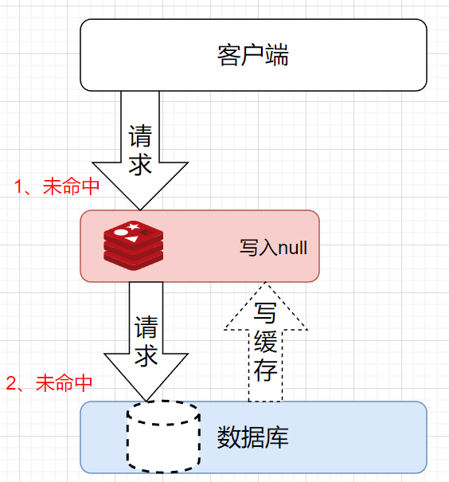

2、布隆过滤

- 优点：内存占用较少，没有多余的key
- 缺点：
  - 实现复杂
  - 存在误判可能


> Bloom Filter参考文章：https://blog.csdn.net/qq_41125219/article/details/119982158

**业务优化**

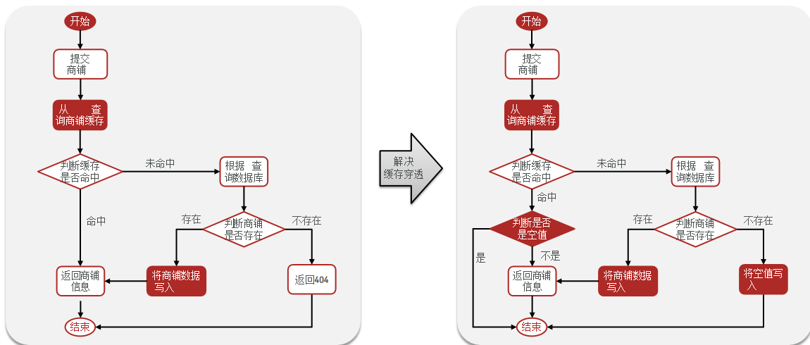

**总结：**

1、缓存穿透产生的原因

- 客户端请求的数据在缓存中和数据库中都不存在，不断发起这样的请求给数据库带来了巨大压力

2、缓存穿透的解决方案

- 缓存null值
- Bloom Filter
- 增加id的复杂度，避免被猜测id生成规律
- 做好数据的基础格式校验
- 加强用户权限校验
- 做好热点参数的限流

#### 5）缓存雪崩

**缓存雪崩**是指同一时段大量的缓存的key同时失效或者Redis服务宕机，带来巨大压力

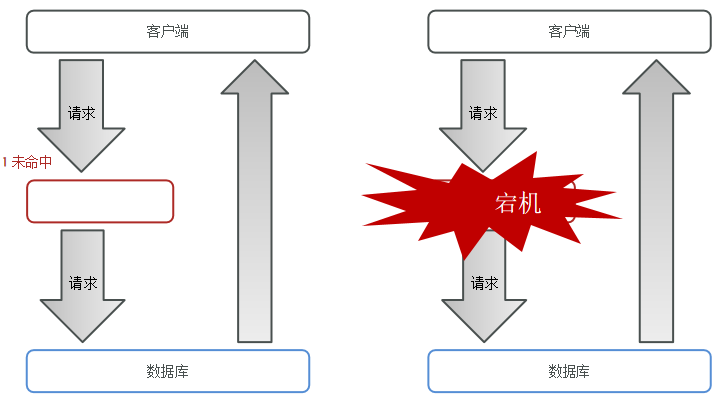

**解决方案：**

- 给不同的Key的TTL添加随机值

  一般在做缓存预热时，可能会提前将数据库中的数据批量导入到缓存中，由于是批量导入的，所以这些 key 的 TTL 是一样的，这就很有可能导致这些 key 在未来的某一时刻一起过期，从而引发缓存雪崩问题。为了解决这个问题，我们可以在做缓存预热时，可以在设置 TTL 时，在 TTL 后面追加一个随机数，比如 TTL 设置的 30 分钟，我们在30 的基础上加上一个 1~5之间的随机数，那么这些 key 的过期时间就会在 30 ~ 35 之间，这样就可以将 key 的过期时间分散开来，而不是一起失效。

- 利用Redis集群提高服务的可用性

  利用 Redis 的哨兵机制，Redis 哨兵机制可以实现服务的监控，比如在一个主从模式下的 Redis  集群，当主机宕机时，哨兵就会从从机中选出一个来替代主机，这样就可以确保 Redis  一直对外提供服务。另外，主从模式还可以实现数据的同步，当主机宕机，从机上的数据也不会丢失。

- 给缓存业务添加降级限流策略

- 给业务添加多级缓存

  可以先在反向代理服务器 Nginx 中做缓存，在 Nginx 中未命中缓存时，再去 Redis 中查询。

#### 6）缓存击穿

**缓存击穿问题**也叫热点key问题，就是一个被**高并发访问**并且**缓存重建业务较复杂**的key突然失效了，无数的请求访问在瞬间给数据库带来了巨大的冲击


常见的**解决方案**

- 互斥锁

  

  > 假设线程 1 查询缓存未命中，那么线程 1 就需要进行缓存重建工作，为了避免其他线程重复线程1 的工作，那么线程 1 就必须要先获取互斥锁，只有获取锁成功的线程才能够重建缓存数据。重建完成后，线程 1 就会将数据写入到缓存中，并将锁释放。如果在线程 1 将数据写入缓存之前，其他线程涌入，这个时候，其他线程查询缓存依然是未命中的，那么这些线程为了重建缓存，也必须先获取到互斥锁，但是，由于此时线程 1 未释放锁，所以其他线程就会获取锁失败，一旦获取锁失败，一般程序处理是让线程休眠一会儿，然后再重试（包括查询缓存以及获取互斥锁），如果线程 1 执行缓存重建时间过长，就会导致其他线程一直处于阻塞等待重试的状态，效率过低。

- 逻辑过期

  

  > 当我们在向 Redis 中存储数据时，不再为 key 设置过期时间（TTL），但是，需要在 value 中额外添加一个逻辑时间（以当前时间为基础，加上需要设置的过期时间），也就是说，这个 key 一旦存入到 Redis 中，就会永不过期。假设线程 1 在查询缓存时发现逻辑时间已经过期，为了避免出现多个线程重建缓存，线程 1 就会去获取互斥锁，一旦线程 1 获取互斥锁成功，线程 1 就会开启一个独立线程，由独立线程去查询数据库重建缓存数据，以及写入缓存重置逻辑过期时间等操作，一旦完成操作，独立线程就会将互斥锁释放掉。线程 1 在开启独立线程后，会直接将过期数据返回。而在独立线程释放锁之前，缓存中的数据都是过期数据。当其他线程在此之前涌入程序时，去查询缓存获取到依旧是逻辑时间过期的数据，那么这些线程就会试图获取互斥锁，此时由于独立线程还未释放锁，所以会获取锁失败，一旦失败，这些线程就会将查询到的旧数据返回。只有当独立线程执行结束，其他线程才会从缓存中获取到新数据

方案对比

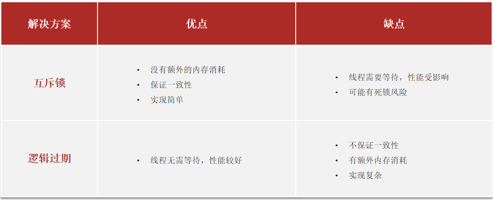

**基于互斥锁方式解决缓存击穿问题**

需求：修改根据id查询商铺的业务，基于互斥锁方式来解决缓存击穿问题


> **注意**：获取锁成功应该再次检查缓存是否存在，做`DoubleCheck`，如果存在则无需重建缓存

使用`SETNX`实现互斥锁，`SETNX `只有在 `key `不存在的时候才能存储成功，并且返回；如果 Redis 中存在要设置的 key，则存储不成功，并且返回 0。

> 当有多个线程同时获取互斥锁时，根据 `SETNX `的特性，那么只会有其中一个线程 `SETNX `成功，其他线程在 `SETNX `时，只能返回 0，而释放锁也很简单，只需要**删除 key** 即可。
>
> 但是，这种方案会存在一个问题，当线程获取到互斥锁后，由于程序出现问题，导致锁迟迟无法释放，所以我们在获取互斥锁时，即在执行 SETNX 命令时，往往会**添加上一个有效期**，一般有效期时长会是业务程序执行时间10~20倍，避免异常情况。

`Jemeter`测试：线程数1000，时间5s

理想情况：`qps = 200/sec`

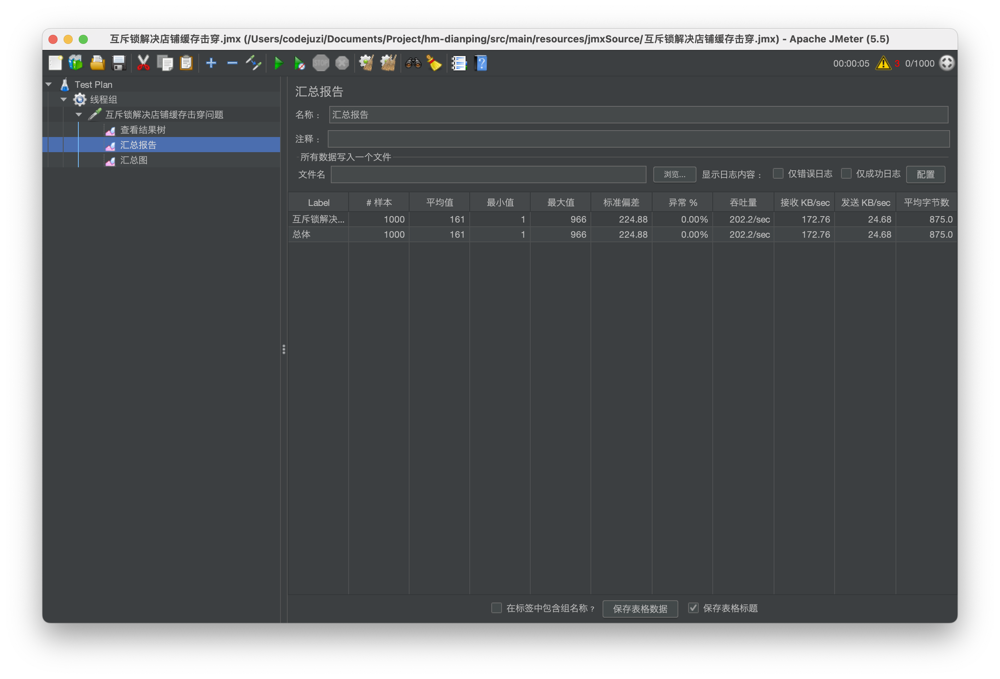

实际情况：`qps = 202.2/sec`

**基于逻辑过期方式解决缓存击穿问题**

需求：修改根据id查询商铺的业务，基于逻辑过期方式来解决缓存击穿问题


> **注意**：获取锁成功应该再次检查缓存是否存在，做`DoubleCheck`，如果存在则无需重建缓存

理论上来讲，一旦热点 key 添加 Redis 中，key 就不会过期，就会永久存在，只有活动结束才会将热点 key 从缓存中删除。一般而言，热点 key 通常是参加活动的商品或者其他一些东西，这些数据会提前加入缓存，并设置逻辑过期时间，所以说，这些热点 key 理论上是一直存在的，直至活动结束删除。因此，当我们查询热点 key 时不用判断有没有命中，如果说缓存未命中，说明这个商品不在活动当中，不属于热点 key。
综上，在程序设计时，**针对热点 key 可以不用进行缓存穿透的处理**。

`Jemeter`测试：线程数1000，时间5s

理想情况：qps达到`200/sec`

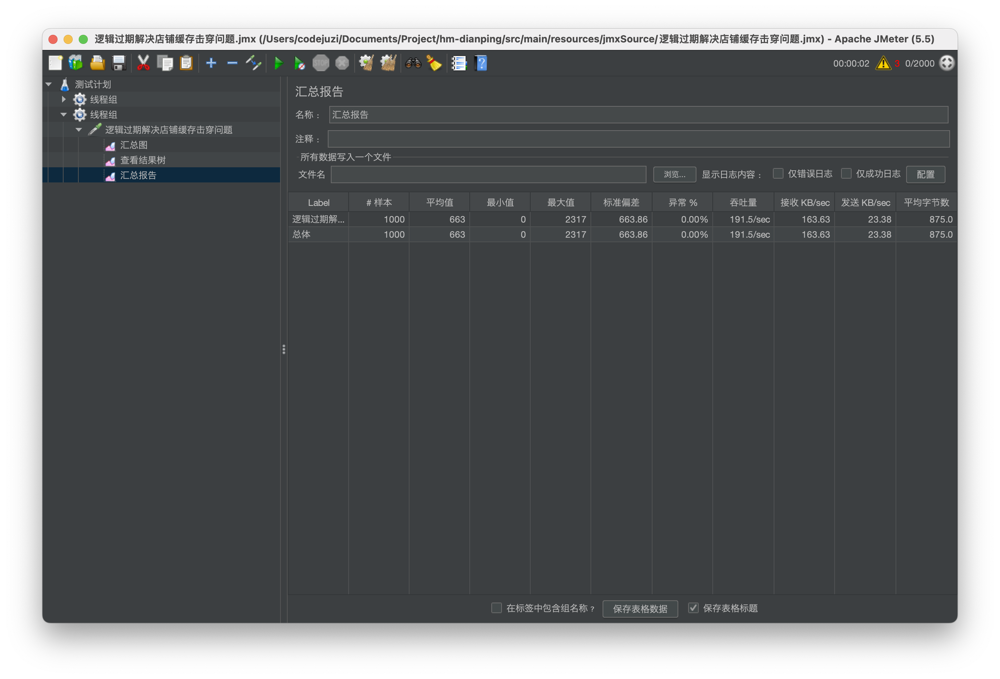

实际情况：`qps = 191.5/sec`


### 5、抢购秒杀券

#### 1）全局唯一ID

每个店铺都可以发布[优惠券](https://so.csdn.net/so/search?q=优惠券&spm=1001.2101.3001.7020)，而每张优惠券都是唯一的。当用户抢购时，就会生成订单并保存到 tb_voucher_order 这张表中，而订单表如果使用数据库自增 ID 就存在一些问题：

- **id 的规律太明显**。如果 id 规律太明显，用户就能够根据 id 猜测出一些信息。比方说，某用户第一天下了一单，此时 id 为 10，第二天同一时刻，该用户又下了一单，此时 id 为 100，那么用户就能够推断出昨天一天店家卖出了 90 单，这就将一些信息暴露给用户。
- **受单表数据量的限制**。订单的一个特点就是数据量比较大，只要用户不停地产生购买行为，就会不停地产生新的订单。如果网站做到一定的规模，用户量达到数百万，这时候每天都会产生数十万甚至近百万的订单，一年下来就会达到数千万的订单，那么两年三年不断累积下来，订单量就会越来越庞大，此时单张表就无法保存这么多的订单数据，就需要将单张表拆分成多张表。MySQL 的每张表会自己计算自己的自增长，如果每张表都使用自增长，订单 id 就一定会重复。

**全局唯一ID生成器**是一种在**分布式系统**下用来生成全局唯一ID的工具，一般要满足如下特性：

- 唯一性
- 高可用
- 高性能
- 递增性
- 安全性

为了增加ID的安全性，开发者在开发的时候不要直接使用Redis自增的数值，而是拼接一些其他的信息：

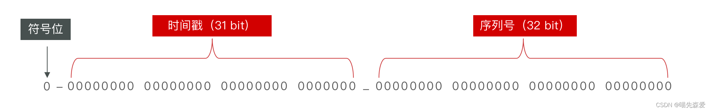


ID组成部分：

- 符号位：`1bit`，永远为0
- 时间戳：`31bit`，以秒为单位，可以使用69年
- 序列号：`32bit`，秒内的计数器，支持每秒产生2 ^32^个不同的ID

=> 使用Java中的`Long`类型生成

> **小技巧**：在设置Redis的key时，可以拼接上时间格式为`yyyy:MM:dd`的字符串，因为Redis在存储key的时候，会以`:`为分割线，这样设计方便统计以年月日为单位的订单数量

**总结**

全局唯一ID的生成策略：

- UUID：16进制的字符串ID，可以做唯一ID，但不支持自增
- Redis自增
- SnowFlake雪花算法：long 类型的 64 ID，性能更好，但是比较依赖于时钟，如果时间不准确，可能会出现异常问题
- 数据库自增：单独创建一张表，用于实现自增

Redis自增ID策略：

- key设计的时候搭配时间，方便统计订单量
- ID构造是 `时间戳 + 计数器`

#### 2）优惠券秒杀下单

**分析**

每个店铺都可以发布优惠券，分为平价券和特价券。平价券可以任意购买，而特价券需要秒杀抢购：


表关系如下：

- `tb_voucher`：优惠券的基本信息，优惠金额、使用规则等。
- `tb_seckill_voucher`：优惠券的库存、开始抢购时间，结束抢购时间。特价优惠券才需要填写这些信息

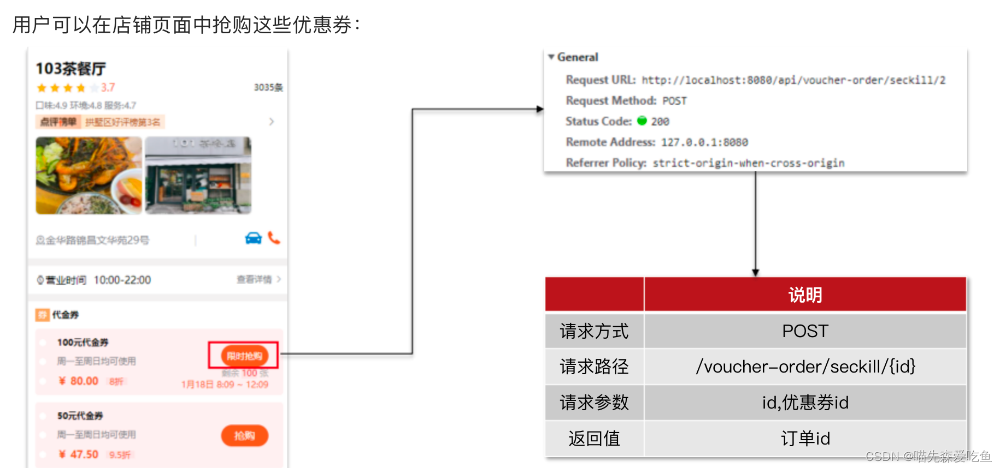

**实现**

下单时需要判断两点：

- 秒杀是否开始或结束，如果尚未开始或已经结束则无法下单
- 库存是否充足，不足则无法下单

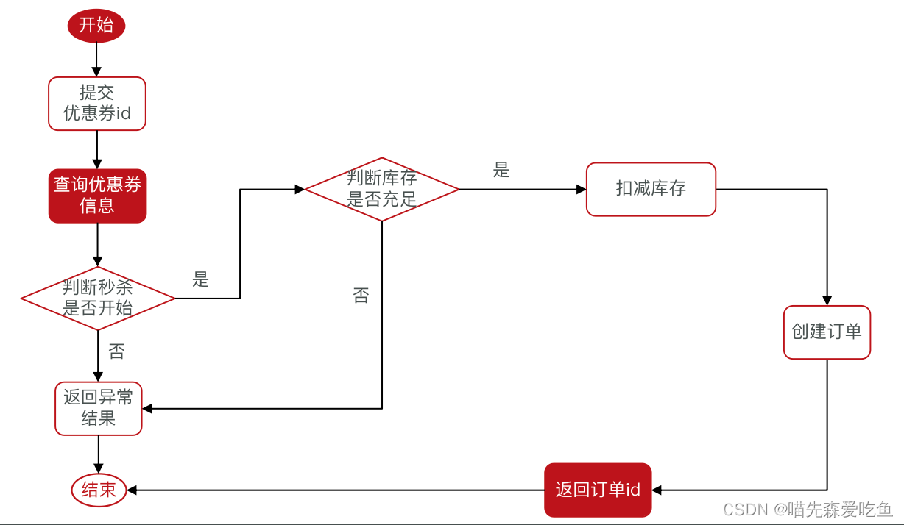

#### 3）超卖问题

`Jmeter`测试：200个线程


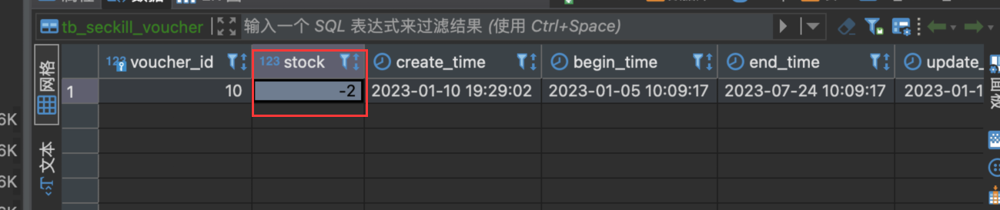


**超卖问题出现的原因**

在高并发情况下，假设线程 1 查询库存，查询结果为 1 ，当线程 1 准备要去扣减库存时，其他线程也去查询库存，结果查询出来的库存数也是 1，那么这时所有的线程查询到的库存数都是大于 0 的，所有的线程都会去执行扣减操作，就会导致超卖问题。


超卖问题是典型的多线程安全问题，针对这一问题的常见解决方案就是**加锁**：


**悲观锁：**

 悲观锁可以实现对于数据的串行化执行，比如syn，和lock都是悲观锁的代表，同时，悲观锁中又可以再细分为公平锁，非公平锁，可重入锁，等等

**乐观锁**

乐观锁的关键是判断之前查询得到的数据是否有被修改过，常见的方式有两种：

1）版本号法：给查询得到的数据加一个版本号，在多线程并发的时候，基于版本号来判断数据有没有被修改过，每当数据被修改，版本号就会加1。

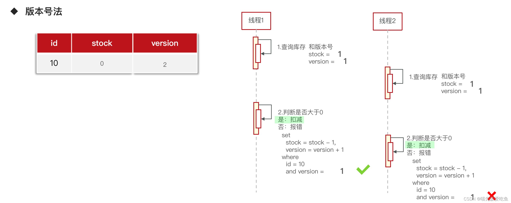

2）CAS(Compare And Swap)法

比较和替换法，是在版本号法的基础上改进而来。CAS  法去除了版本号法中的版本号信息，以库存信息本身有没有变化为判断依据，当线程修改库存时，判断当前数据库中的库存与之前查询得到的库存数据是否一致，如果一致，则说明线程安全，可以执行扣减操作，如果不一致，则说明线程不安全，扣减失败。

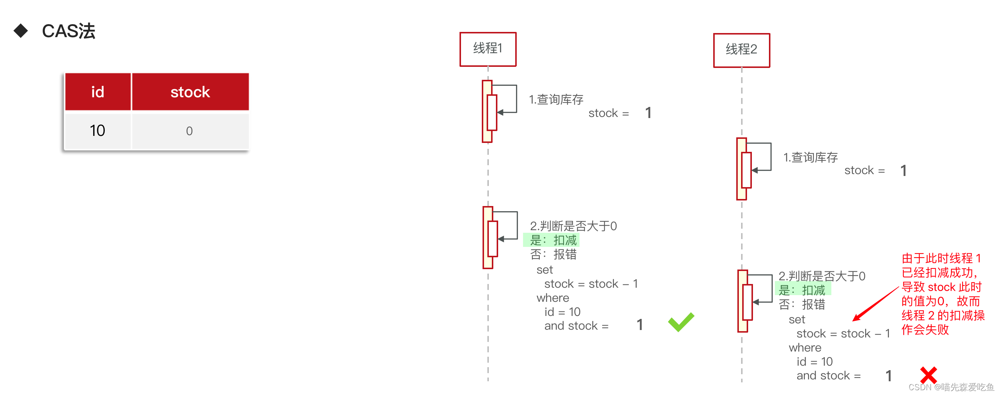

`Jmeter`测试：200个线程


> 优化：库存数只要大于0，就应该允许所有线程都能够执行扣减逻辑。

`Jmeter`测试

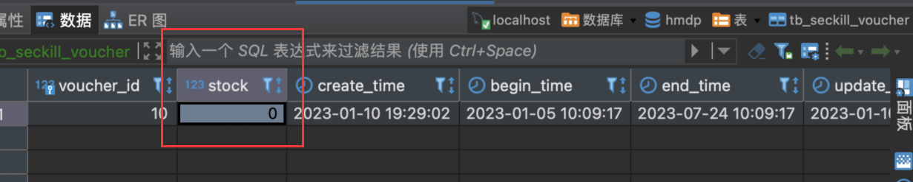

**总结**

超卖这样的线程安全问题，解决方案：

1. 悲观锁：添加同步锁，让线程串行执行
   - 优点：简单粗暴
   - 缺点：性能一般
2. 乐观锁：不加锁，在更新时判断是否有其他线程在修改
   - 优点：性能好
   - 缺点：存在成功率低的问题

> 补充：像上面的库存这种案例比较特殊，只需判断库存是否大于 0 即可，但是有些情况可能就只能通过判断数据有没有发生变化，这种情况要想提高成功率，可以采用分批加锁（分段锁）的方案，将数据资源分成几份，以库存为例，假设库存数 100，可以将库存分到 10 张表中，每张表中库存数为 10，用户在抢购的时候可以在多张表中进行抢购，这样成功率就会提高。

#### 4）实现一人一单（单体服务）

需求：修改秒杀业务，要求同一个优惠券，一个用户只能下一单。

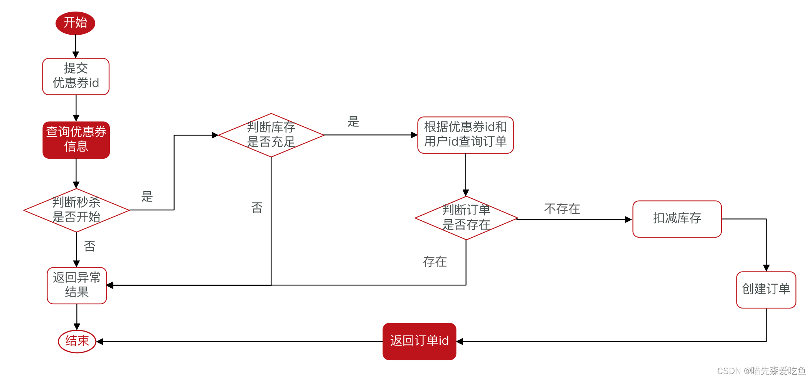


`Jmeter`测试


可以看出，还有出现了一人多单的情况，因此需要给每一个用户加唯一的锁限制

```java
synchronized (userId.toString().intern()) {
  return this.createVoucherOrder(voucherId);
}
```

以上代码会出现`Spring事务失效的问题`

> 参考文章：
>
> - [(74条消息) Spring事务失效的8种情况_不想做咸鱼的王富贵的博客-CSDN博客_spring事务失效](https://blog.csdn.net/weixin_43564627/article/details/121354260)
> - [(74条消息) spring事务的失效_@_大海的博客-CSDN博客_spring事务失效](https://blog.csdn.net/qq_35363433/article/details/125239216)

**解决方案**：获取代理对象，通过代理对象调用方法

```java
synchronized (userId.toString().intern()) {
    // 获取代理对象
  IVoucherOrderService proxy = (IVoucherOrderService) AopContext.currentProxy();
  return proxy.createVoucherOrder(voucherId);
}
```

引入依赖

```java
<dependency>
    <groupId>org.aspectj</groupId>
    <artifactId>aspectjweaver</artifactId>
</dependency>
```

开启暴露代理注解

```java
@MapperScan("com.hmdp.mapper")
@SpringBootApplication
@EnableAspectJAutoProxy(exposeProxy = true)
public class HmDianPingApplication {

    public static void main(String[] args) {
        SpringApplication.run(HmDianPingApplication.class, args);
    }

}
```


`Jmeter`测试

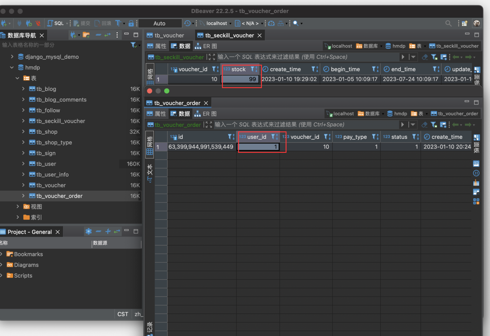


#### 5）集群模式下一人一单的并发安全问题

假设做集群部署时，有两个 Tomcat，每个 Tomcat 都有各自的 JVM。在 每个 JVM 内部会维护一个锁的监视器对象，而秒杀方法中，锁的监视器对象用的是用户 id，而用户 id 是放置在了常量池中，一个 JVM 中维护一个常量池，那么不同的 JVM 有不同的常量池，所以当其他线程去执行秒杀逻辑时，获取不到 其他 JVM 中已经存在的锁监视器对象，这种情况下就又会出现线程安全问题。

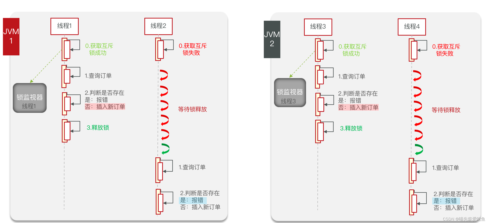

=> 解决方案：**分布式锁**

### 6、分布式锁解决集群模式下的抢购优惠券的并发安全问题

#### 1）分布式锁的工作原理

在集群模式下，`synchronized`锁只能保证单个JVM内部的多个线程之间的互斥，而没有办法让给集群下的多个JVM进程之间互斥

=> 解决：让多个JVM使用同一个锁监视器，该锁监视器是位于JVM外部的、多个JVM进程都能看到的。

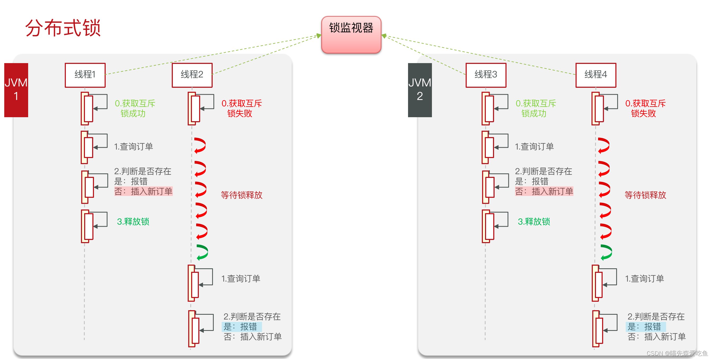

假设有两个 JVM，此时 JVM1 中的线程 1 需要获取互斥锁，就会去找外部的锁监视器，一旦获取成功，锁监视器就会记录当前线程。恰好，JVM2 中的线程 3 也想获取互斥锁，这个时候由于锁监视器已经被JVM1 中的线程 1 所使用，线程 3 就会获取锁失败，一旦失败，线程 3 就会等待锁释放，而线程 1 由于获取锁成功，就会执行查询订单，判断订单是否存在，插入订单等业务逻辑，执行结束线程 1 就会释放锁，线程 3 就会获取所成功，也开始执行查询订单逻辑，由于 JVM 1 中的线程 1 已经插入订单，此时 JVM2 中的线程 3 就会查询到订单，就无法再插入新订单，也就解决了多进程之间的一人一单问题。

#### 2）分布式锁的概念

1、分布式锁：满足分布式系统或者集群模式下多进程可见并且互斥的锁

2、分布式锁应当满足如下几点：

- 多进程可见
- 互斥：必须确保只能有一个线程能拿到互斥锁
- 高可用：必须保证大多数情况下获取锁都是成功的
- 高性能：加锁以后就会影响业务的性能，加锁后业务的执行变成串行执行，如果此时获取锁的操作执行慢，就会导致执行效率更低
- 安全性：在获取锁的时候应当考虑一些异常情况，比如获取锁后还未释放，服务器宕机，锁需要如何处理，又或者会不会产生死锁问题

#### 3）分布式锁的实现方式

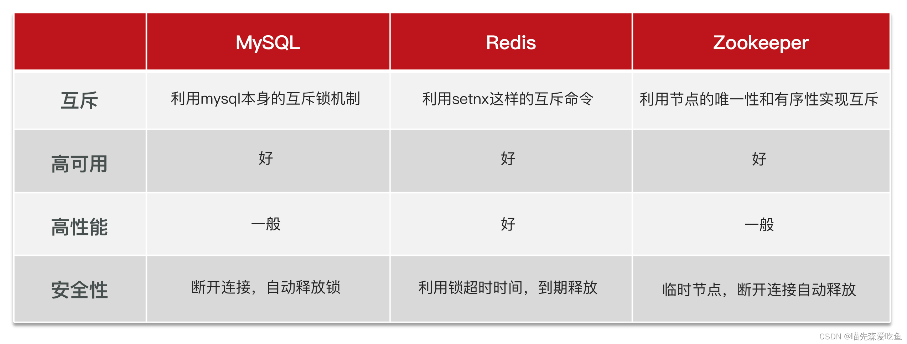

1. `MySQL`：MySQL 本身具备事务机制，在事务执行的时候，或者说在执行写操作的时候，MySQL 会自动分配一个互斥的锁，这样在多个事务之间就是互斥的，可以用这个原理来实现锁。

   假设现在有业务需要用到分布式互斥锁，我们可以在业务执行前，先去 MySQL 中申请一个互斥锁，当业务执行结束，就可以提交事务，锁就会释放，当业务抛出异常时，就会自动触发回滚，锁也会释放。MySQL 本身支持主从模式，所以高可用性能比较好。至于性能，就会受限于 MySQL 的性能，相比较于 Redis 而言，其性能一般。

2. `Redis`：利用 `SETNX `互斥命令，当使用 SETNX 命令向 Redis 中存储数据时，只有该数据的 key 不存在时才能存储成功，如果已经存在，就会存储失败。释放锁时，只需要将 key 删除即可。**Redis 支持主从模式、集群模式，可用性高。Redis 的性能也远远高于 MySQL。**

   但是 Redis 在使用 SETNX 命令存储数据成功后，一旦 Redis 服务宕机，那锁就无法释放，就会导致其他线程拿不到锁，出现死锁。这里可以在 SETNX 时，设置过期时间，但是如果过期时间设置的过长，那么锁的无效等待时间就会比较多，如果设置过短，有可能导致业务没有执行结束就将锁释放掉。

3. `Zookeeper`：Zookeeper 实现锁的原理是基于它内部的节点机制。

   Zookeeper 内部可以创建数据节点，而节点具有唯一性和有序性，另外，Zookeeper 还可以创建临时节点。所谓唯一性就是在创建节点时，节点不能重复；所谓有序性是指每创建一个节点，节点的id是自增的。那么就可以利用节点的有序性来实现互斥。当有大量线程来获取互斥锁时，每个线程就会创建一个节点，而每个节点的 id 是单调递增的，如果我们约定 id 最小的那个获取锁成功，这样就可以实现互斥。当然，也可以利用唯一性，让所有线程去创建节点，但是节点名称相同，这样就会只能有一个线程创建成功。一般情况下，会使用有序性来实现互斥。想要释放锁，则只需要将节点删除即可，一旦将最小节点删除，那么剩余节点中 id 最小的那个节点就会获取锁成功。Zookeeper 本身也支持集群，所以其可用性很好。

   而Zookeeper 的集群强调节点之间的强一致性，而这种强一致性就会导致主从之间在进行数据同步时会消耗一定的时间，其性能相较于 Redis 而言会差一点。安全性方面，Zookeeper 一般创建的是临时节点，一旦服务出现故障，Zookeeper 就会自动断开连接，锁就会自动释放掉。

#### 4）基于Redis的分布式锁

实现分布式锁时需要两个基本操作：

1、**获取锁**

互斥：确保只能有一个线程获取锁

```bash
# 添加锁，利用SETNX的互斥特性
SETNX lock thread1

# 添加锁过期时间，避免服务宕机引起的死锁
EXPIRE lock 10
```

如果先添加锁，此时Redis服务恰好宕机，那么锁就无法释放 => 需要保证操作的原子性，在添加锁的同时设置过期时间

```bash
# EX 后跟过期时间，NX 保证互斥特性
set lock thread1 EX 10 NX
```

在获取锁时，成功返回 OK，失败返回 nil。

`获取锁失败后的处理`：

- 阻塞式获取：即获取失败后会一直等待锁释放 （对内存有一定的浪费并且实现起来困难）
- 非阻塞式获取：即获取失败后立即返回 （此处使用的方式，尝试一次，成功返回true，失败返回false）

2、**释放锁**

手动释放：

```bash
# 释放锁，删除即可
del key
```

超时释放：获取锁时添加一个超时时间

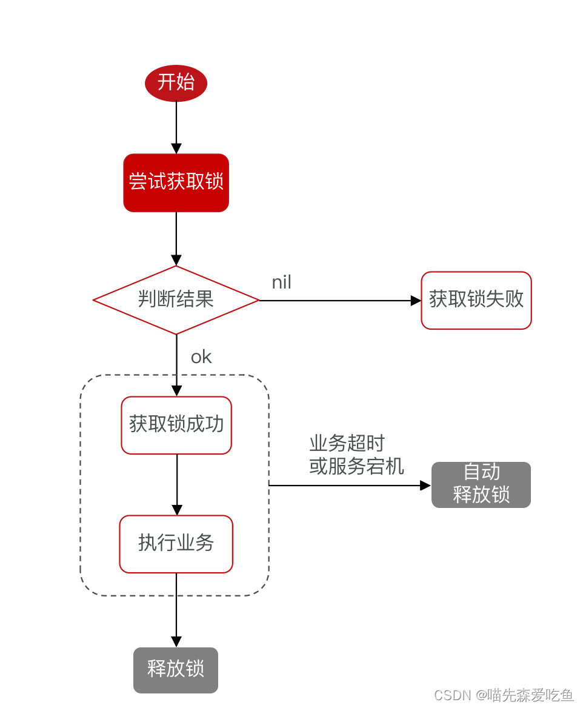

`Postman`测试

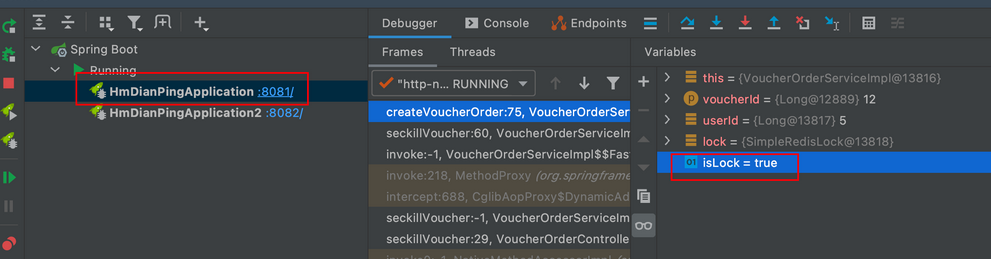


#### 5）Redis分布式锁误删问题


假设线程 1 获取互斥锁且获取成功，拿到锁后，线程 1 开始执行业务，但是由于某种原因，线程 1 的业务发生了阻塞，那么线程 1 持有锁的周期就会变长，那会在什么时候释放锁呢？一种情况是线程 1 的业务执行结束，由线程 1 执行释放锁的逻辑。还有一种情况是，由于线程 1 阻塞时间过长，超过了锁自动释放的时间，使得锁自动释放掉了，即业务还未执行结束，锁提前释放掉了。第二种情况，会有什么问题呢？如果此时，其他线程也去尝试获取锁，就会获取成功。假设此时线程 2 成功拿到锁，然后执行自己的业务。而就在此时，线程 1 从阻塞中被唤醒了，业务执行结束，然后就会去释放锁，此时释放掉的的锁其实是线程 2 的锁。线程 2 并不知道自己的锁已经被线程 1 给释放掉了，还在执行自己的业务。恰巧此时，线程 3 又获取锁成功，然后线程 3 也开始执行自己的业务，那么此时此刻，就会有两个线程都拿到了锁都在执行业务，又一次出现并行问题，线程安全问题就有可能再次发生。

**解决方案**

1. 在获取锁时存入线程标识（可以使用UUID标识）
2. 在释放锁时先获取锁中的线程标识，判断是否与当前线程标识一致，如果一致则释放锁，否则不释放锁

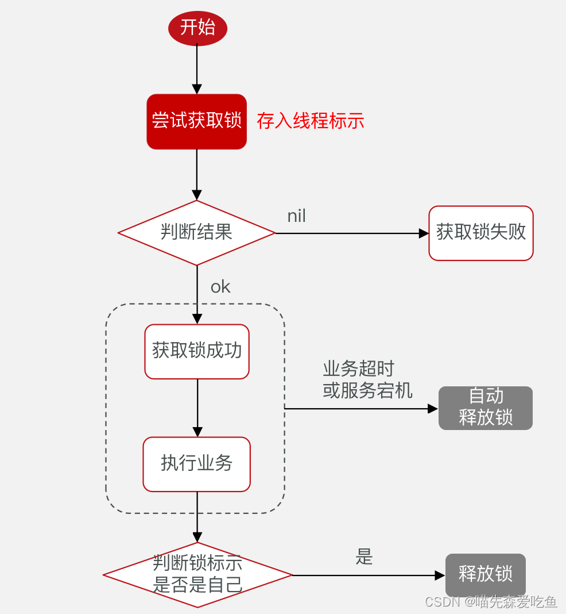


#### 6）分布式锁的原子性问题

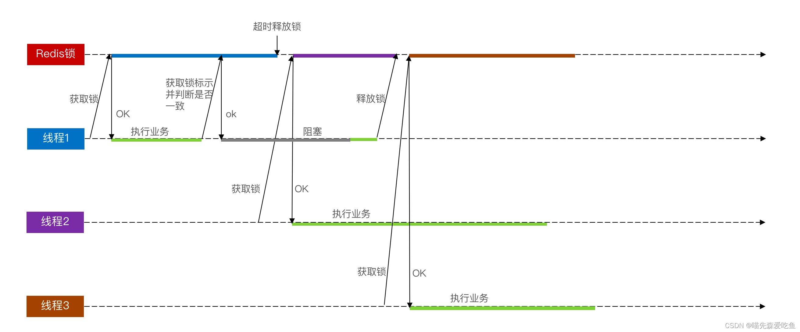

假设线程 1 获取互斥锁且获取成功，拿到锁后，线程 1 开始执行业务，执行结束后，线程 1 的准备释放锁，但在此时线程 1 发生了阻塞，由于线程 1 阻塞时间过长，超过了锁自动释放的时间，使得锁自动释放掉了。此时线程 2 成功拿到锁，然后执行自己的业务。而就在此时，线程 1 从阻塞中被唤醒了，业务执行结束，然后就会去释放锁，此时释放掉的的锁其实是线程 2 的锁。线程 2 并不知道自己的锁已经被线程 1 给释放掉了，还在执行自己的业务。恰巧此时，线程 3 又获取锁成功，然后线程 3 也开始执行自己的业务，那么此时此刻，就会有两个线程都拿到了锁都在执行业务，又一次出现并行问题，线程安全问题就有可能再次发生。

**解决方案**

确保判断锁标识的动作和释放锁的动作一起执行，不能存在间隔。 => 使用`Lua`脚本

> #### Lua脚本简介
>
> Redis 提供了 Lua 脚本功能，在一个脚本中编写多条 Redis 命令，确保多条命令执行时的原子性。Lua 是一种编程语言。https://www.runoob.com/lua/lua-tutorial.html
>
> Redis提供的调用函数：
>
> ```bash
> -- 执行 Redis 命令
> redis.call('命令名称', 'key', '其他参数', ...)
> ```
>
> 【例子】执行`set name jack`
>
> ```java
> -- 执行 set name jack
> redis.call('set', 'name', 'jack')
> ```
>
> 【例子】执行`set name Rose`，`get name`
>
> ```java
> -- 先执行 set name Rose
> redis.call('set', 'name', 'Rose')
> -- 再执行 get name
> local name = redis.call('get', 'name')
> -- 返回
> return name
> ```
>
> 写好脚本以后，需要用Redis命令来调用脚本，调用脚本的常见命令如下：
>
> 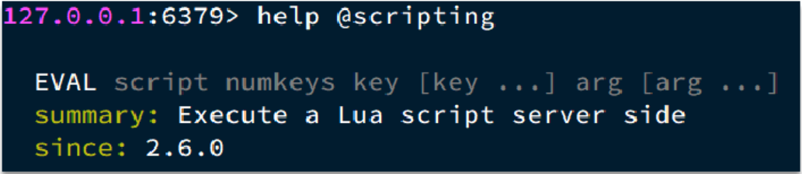
>
> 【例子】执行`redis.call('set', 'name', 'jack') `
>
> 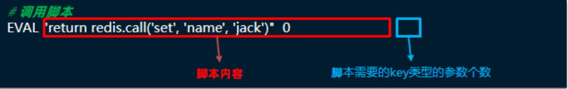
>
> 动态传参：
>
> 

**使用Lua脚本解决释放锁的业务流程**

释放锁的业务流程：

1. 获取锁中的线程标识
2. 判断是否与指定的标识（当前的线程标识）一致
3. 如果一致则释放锁（删除）
4. 如果不一致则跳过

=> 对应的`Lua`脚本

```java
-- 这里的 KEYS[1] 就是锁的 key，这里的 ARGV[1] 就是当前线程标识
-- 获取锁中的标识，判断是否与当前线程标识一致
if(redis.call('get', KEYS[1]) == ARGV[1]) then
    -- 一致，则删除锁
    return redis.call('del', KEYS[1])
end
-- 不一致，则直接返回
return 0
```

在`RedisTemplate`中，可以利用`execute`函数去执行`lua`脚本

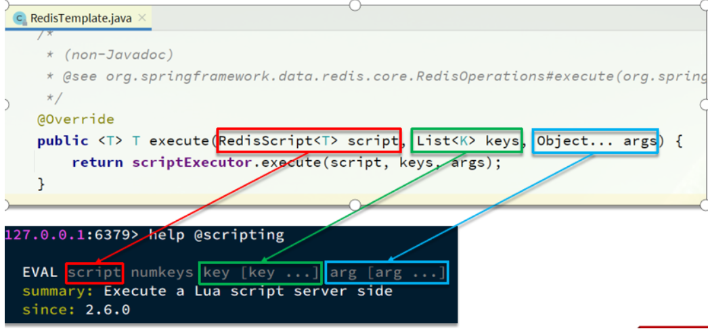

`Jmeter` && `Postman`测试

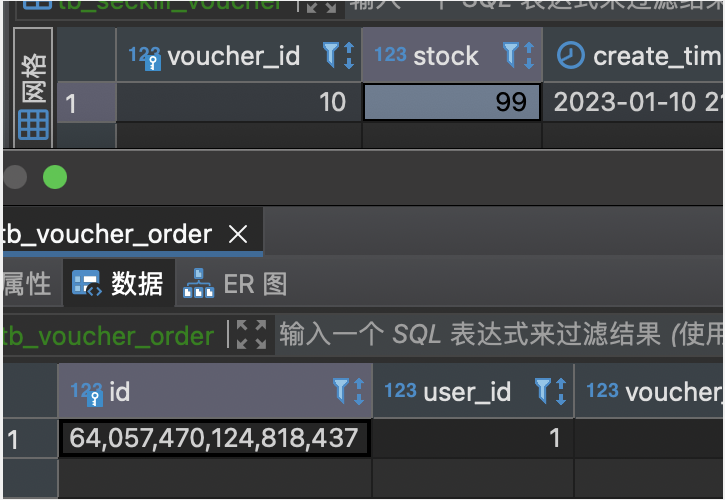

**总结：**

基于`Redis`的分布式锁实现思路

- 利用`set nx ex`获取锁，并设置过期时间，保存线程标识
- 释放锁时先判断线程标识是否与自己锁的标识一致，一致则删除

特性：

- 利用`set nx `满足互斥性
- 利用`set ex`保证故障时锁依然能释放，避免死锁，提高安全性
- 利用`Redis`集群保证高可用和高并发特性

### 7、分布式锁之Redisson

#### 1）基于Redis的SETNX实现分布式锁存在的问题

1、**不可重入**：同一个线程无法多次获取同一把锁

2、**不可重试**：获取锁只尝试一次就返回 false，没有重试机制

3、**超时释放**：锁超时释放虽然可以避免死锁，但如果是业务执行耗时较长，也会导致锁释放，存在安全隐患

4、**主从一致性**：如果 Redis 提供了主从集群，主从同步存在延迟，此时某个线程从主节点中获取到了锁，但是尚未同步给从节点，而恰巧主节点在这个时候发生宕机。就会从从机中选择出一个节点成为新的主节点，那么其他线程就有可能趁虚而入，从新的主节点中获取到锁，这样就出现多个线程拿到多把锁，在极端情况下，可能会出现安全问题。

#### 2）Redisson

> [官网地址](https://redisson.org)
>
> [GitHub地址](https://github.com/redisson/redisson)

Redisson 是一个在 Redis 的基础上实现的 Java 驻内存数据网格（In-Memory Data Grid）。它不仅提供了一系列的分布式的 Java 常用对象，还提供了许多分布式服务，其中就包含了各种分布式锁的实现。

#### 3）Redisson基本使用

[官方文档](https://github.com/redisson/redisson/wiki/%E7%9B%AE%E5%BD%95)

`Jmeter`测试

#### 4）Redisson可重入锁原理

**自定义分布式锁分析**

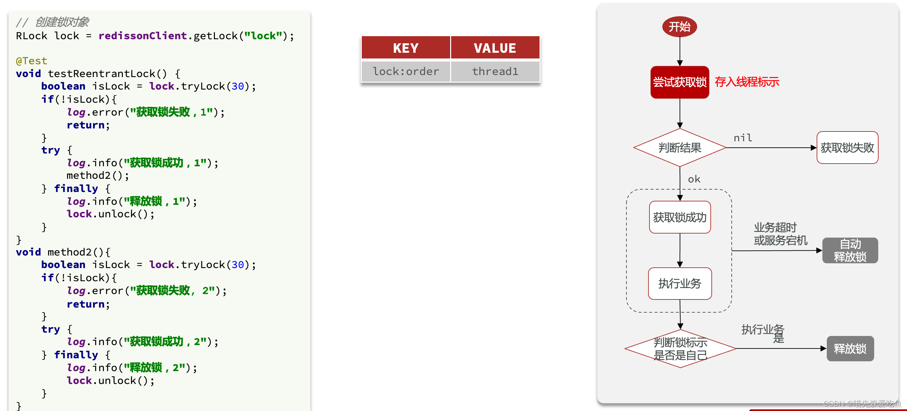

首先定义两个方法，method1 和 method2，method1 在获取到锁的情况下，紧接着去调用 method2 方法，而在  method2 方法中又一次获取了锁，method1 和 method2 是在同一个线程内，在同一个线程内重复获取锁，这就是**锁的重入**。

method1 在获取锁的时候，会执行命令`SET lock thread1 NX EX 10`，在获取到锁后，method1 调用了 method2，接着 method2 尝试获取锁，再一次执行命令`SET lock thread1 NX EX 10`，根据 SETNX 的特性，由于 method1 已经 set 成功，那么 method2 肯定会设置失败，所以也就没办法实现重入。


**Redisson可重入锁的原理**

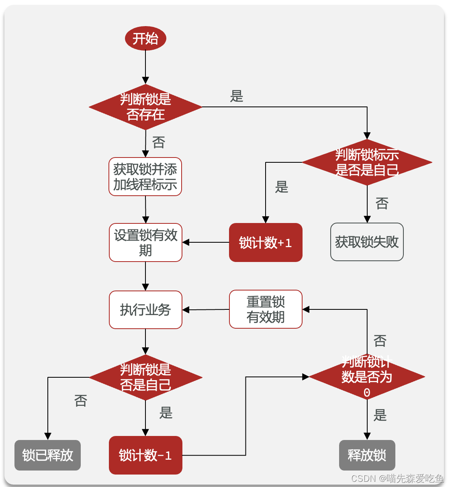

获取锁的脚本

```lua
local key = KEYS[1];  -- 锁的key
local threadId = ARGV[1]; -- 线程唯一标识
local releaseTime = ARGV[2]; -- 锁的自动释放时间

-- 判断是否存在
if(redis.call('exists', key) == 0) then
    -- 不存在，获取锁
    redis.call('hset', key, threadId, '1');
    -- 设置有效期
    redis.call('expire', key, releaseTime);
    return 1; -- 返回结果
end;

-- 锁已经存在，判断threadId是否是自己
if(redis.call('hexists', key, threadId) == 1) then
    -- 存在，获取锁，重入次数+1
    redis.call('hincrby', key, threadId, '1');
    -- 设置有效期
    redis.call('expire', key, releaseTime);
    return 1; -- 返回结果
end;
return 0; -- 代码走到这里，说明获取锁的不是自己，获取锁失败
```

释放锁的脚本

```lua
local key = KEYS[1];  -- 锁的key
local threadId = ARGV[1]; -- 线程唯一标识
local releaseTime = ARGV[2]; -- 锁的自动释放时间

-- 判断当前锁是否还是被自己持有
if(redis.call('hexists', key, threadId) == 0) then
    return nil; -- 如果已经不是自己，则直接返回
end
-- 是自己的锁，则重入次数-1
local count = redis.call('hincrby', key, threadId, -1);
-- 判断重入次数是否已经为0
if(count > 0) then
    -- 大于0说明不能是释放锁，重置有效期然后返回
    redis.call('expire', threadId, releaseTime);
    return nil;
else
    redis.call('del', key); -- 等于 0 说明可以释放锁，直接删除
    return nil;
end
```

#### 5）Redisson的锁重试和WatchDog机制

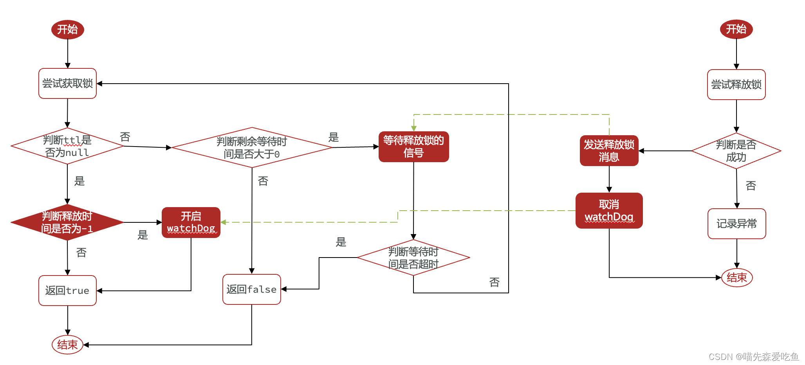

> 参考文章：
>
> - [Redisson 分布式锁源码 01：可重入锁加锁](https://blog.csdn.net/qq_36535538/article/details/118404234) 
> - [Redisson 分布式锁源码 02：看门狗](https://blog.csdn.net/qq_36535538/article/details/118441718)


Redission 分布式锁原理：

- 可重入：利用 hash 结构记录线程 id 和重入次数。每次获取锁时，先判断锁是否存在，如果不存在，则直接获取，如果已经存在，且线程标识为当前线程，则可以再次获取，并将重入次数加 1。释放锁时，每释放一次，重入次数减 1，直至重入次数减为 0，则证明所有的业务已经执行结束，则可以直接释放锁。
- 可重试：利用信号量和 PubSub 功能实现等待、唤醒，获取锁失败的重试机制。在第一次尝试获取锁失败后，并不是立即失败，而是去等待释放锁的信号（利用了 Redis 中 PubSub 机制）。而获取锁成功的线程在释放锁的时候，就会向等待中的线程发送一条消息，等待中的线程捕获到消息后，就可以重新尝试获取锁。如果重试失败，则会继续等待释放锁的信号，然后再去重试。当然，重试并不是无限次的，会有一个等待时间，如果超过等待时间，就结束重试。
- 超时续约：利用 watchDog，每隔一段时间（releaseTime/3），重置超时时间。简单来说，就是在获取锁成功后，会开启一个定时任务，该定时任务每隔一段时间就会重置锁的超时时间，这样锁的超时时间就会重新计时。

#### 6）Redisson的MultiLock原理

**问题**

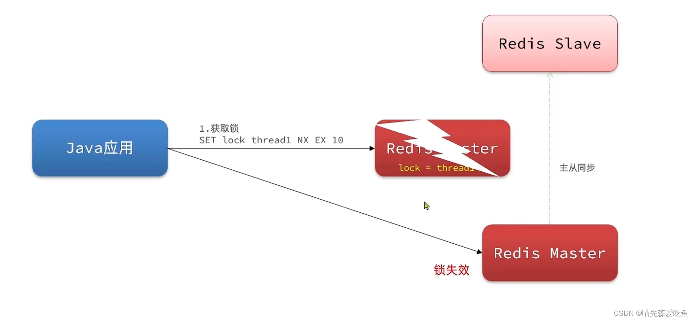

如果 Redis 提供了主从集群，主从同步存在延迟，此时某个线程从主节点中获取到了锁，但是尚未同步给从节点，而恰巧主节点在这个时候发生宕机，Redis 的哨兵模式就会从从机中选择出一个节点成为新的主节点，那么其他线程就有可能趁虚而入，从新的主节点中获取到锁，这样就出现多个线程拿到多把锁，在极端情况下，可能会出现安全问题。

为了解决这个问题，redission提出来了MutiLock锁，使用这把锁咱们就不使用主从了，每个节点的地位都是一样的， 这把锁加锁的逻辑需要写入到每一个主丛节点上，只有所有的服务器都写入成功，此时才是加锁成功，假设现在某个节点挂了，那么他去获得锁的时候，只要有一个节点拿不到，都不能算是加锁成功，就保证了加锁的可靠性。

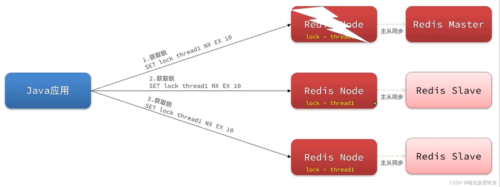

**MutilLock加锁原理**

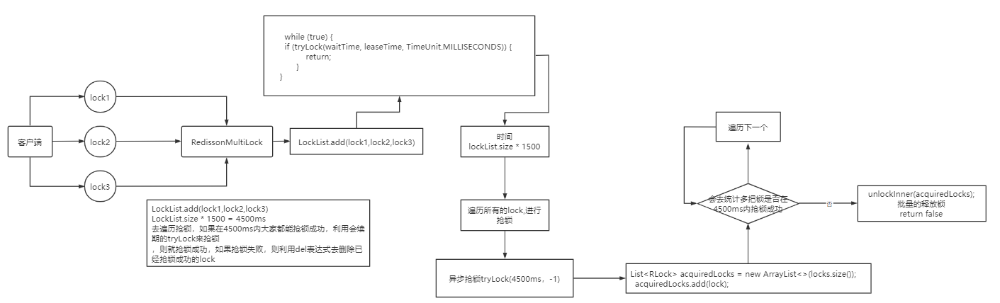


**总结**

不可重入 Redis 分布式锁：

- 原理：利用 SETNX 的互斥性；利用 ex 避免死锁；释放锁时判断线程标识
- 缺陷：不可重入、无法重试、锁超时失效

可重入的 Redis 分布式锁：

- 原理：利用 hash 结构，记录线程标识和重入次数；利用 watchDog 延续锁时间；利用信号量控制锁重试等待
- 缺陷：Redis 宕机引起锁失效问题

Redisson 的 `MultiLock`：

- 原理：多个独立的 Redis 节点，必须在所有节点都获取重入锁，才算获取成功
- 缺陷：运维成本高、实现复杂

### 8、抢购秒杀券性能优化

#### 1）异步秒杀思路

之前的抢购秒杀券的业务流程：


前端发起请求到达 Nginx，Nginx 通过负载均衡，将请求转发至 Tomcat。在 Tomcat 中，程序的执行流程如上图所示，整个业务流程串行执行，所以，整个业务的耗时时间就是每一步的耗时之和。

但是，在整个业务流程中，其中，查询优惠券、查询订单、减库存以及创建订单这四步都需要与数据库建立连接，执行相关的增删改查操作。由于数据库本身的并发能力是比较差的，再加上减库存和创建订单还是对数据库的写操作，另外为了避免线程安全问题，在执行减库存以及创建订单逻辑时间，还增加了分布式锁，这就导致了整体业务的耗时就会比较长，并发能力比较弱。

**优化方案**

**分离业务**：由于判断秒杀库存以及校验一人一单的逻辑执行时间较短，而减库存、创建订单是对数据库的写操作，耗时较久，可以将这两个部分拆分开来，由不同的线程进行执行。请求进来以后，主线程判断用户的购买资格，如果用户有购买资格，则开启独立线程来处理耗时较久的减库存以及下单操作，这样执行效率就会大大提高。为了进一步提高项目的性能，还应该进一步提高对于秒杀资格的判断的执行效率。由于判断秒杀资格依然需要查询数据库，为了提高效率，完全可以将优惠券信息以及订单信息缓存到 Redis 中，把对于秒杀资格的判断放到 Redis 中来执行。当秒杀资格判断执行结束后，程序可以直接将订单 id 返回给用户，用户则可以拿着订单 id 完成后续的付款等操作。对于减库存以及下单操作，如果用户有资格下单，就可以将优惠券 id、用户 id以及订单 id 等信息存储到阻塞队列中，然后由独立线程异步读取阻塞队列中的信息，完成操作。


**难点：如何在Redis中完成秒杀库存的判断和一人一单的判断？**

要想在 Redis 中判断库存是否充足以及一人一单，就需要将库存信息以及有关的订单信息缓存到 Redis 中，那我们应该选择什么样的数据结构来存储库存信息以及订单信息呢？优惠券的库存比较简单，库存是一个数据，可直接使用 String 类型进行存储，key 为优惠券的 id，value 为库存的值。要实现一人一单功能，就需要在 Redis 中记录当前优惠券被哪些用户购买过，后续再有用户购买时，只需要判断该用户是否在记录当中存在。那什么样的数据结构满足这样的需求呢？该数据结构首先应当满足在一个 key 中可以保存多个值，即一个订单对应多个用户，其次，由于一人一单，那么保存的用户 id 就不能重复。

=> `Set`类型的数据结构

> `Set`结构的特点：
>
> - 无序
> - 元素不可重复
> - 查找快
> - 支持交集、并集、差集等功能

**分析业务执行流程**

由于秒杀库存以及校验一人一单对 Redis 的判断较多，业务流程较多，为了保证业务执行的原子性，需使用`Lua`脚本来完成。


**业务逻辑**

* 新增秒杀优惠券的同时，将优惠券信息保存到Redis中

* 基于Lua脚本，判断秒杀库存、一人一单，决定用户是否抢购成功

* 如果抢购成功，将优惠券id和用户id封装后存入阻塞队列

* 开启线程任务，不断从阻塞队列中获取信息，实现异步下单功能

**总结**

秒杀业务的**优化思路**是什么？

=>**变同步下单变成异步下单**

- 先利用 Redis 完成库存余量、一人一单判断，完成抢单业务
- 再将下单业务放入阻塞队列，利用独立线程异步下单

基于阻塞队列的异步秒杀存在哪些问题？

- **内存限制问题**：我们使用的 JDK 中的阻塞队列，使用的是 JVM 的内存，如果不加以限制，在高并发的情况下，就会有无数的订单对象需要去创建，并且存入阻塞队列中，可能会导致将来内存溢出，所以我们在创建阻塞队列的时候，设置了队列的长度。但是如果队列中订单信息存满了，后续新创建的订单就无法存入队列中。
- **数据安全问题**：我们是基于内存保存的订单信息，如果服务突然宕机，那么内存中的订单信息也就丢失了。

未优化前：

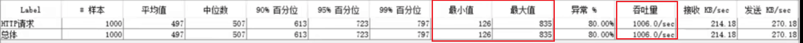

- 最小值：126/s
- 最大值：835/s
- 平均值：597/s
- 吞吐量：`1006/s`

优化之后：

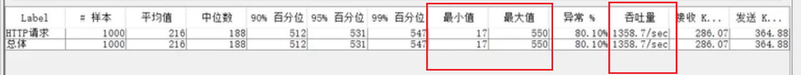

- 最小值：17/s
- 最大值：550/s
- 平均值：216/s
- 吞吐量：`1358.7/s`

### 9、Redis消息队列

#### 1）认识消息队列

**消息队列**（**M**essage **Q**ueue），字面意思就是存放消息的队列。最简单的消息队列模型包括3个角色：

- 消息队列：存储和管理角色，也被称为消息代理（Message Broker）
- 生产者：发送消息到消息队列
- 消费者：从消息队列中获取消息并处理消息


**消息队列和阻塞队列的区别：**

- 消息队列是在JVM之外的独立服务，不受JVM内存的限制
- 消息队列做数据存储的同时，还需要确保数据安全，存入到消息队列中的所有信息都需要做持久化处理，这样不管是服务重启或者宕机，数据都不会丢失。
- 消息队列会确保消息的确认，在消息投递给消费者后，要求消费者做消息确认，如果消费者没有做确认，那么这条消息就会一直存在于消息队列中，下一次还会继续投递给消费者，让消费者做处理，知道消息被消费者成功处理确认。

#### 2）Redis提供的消息队列

Redis中提供了三种基于不同的方式来实现消息队列：

- `List`结构：基于List结构模拟消息队列
- `PubSub`：基本的点对点消息模型
- `Stream`：比较完善的消息队列模型


#### 3）基于List结构模拟消息队列

Redis的`List`数据结构是一个双向链表，容易模拟出队列效果。

队列是入口和出口不在一边，可以使用`LPUSH`结合`RPOP`，或者`RPUSH`结合`LPOP`来实现

**注意**：当队列中没有消息时`RPOP`或者`LPOP`操作会返回`null`，并不是像JVM的阻塞队列那样会阻塞并等待消息。

=> 此处使用`BRPOP`或者`BLPOP`来实现阻塞效果


**总结：**

基于List的消息队列的优缺点：

优点：

- 利用Redis存储，不受限于JVM内存上限
- 基于Redis的持久化机制，数据安全性有保证
- 可以满足消息有序性

缺点：

- 无法避免消息丢失
- 只支持单消费者


#### 4）基于PubSub的消息队列

`PubSub`（**发布订阅**）是Redis2.0版本引入的消息队列传递模型。

订阅者可以订阅一个或多个channel，生产者向对应的channel发送消息后，所有订阅者都能收到相关消息

- `SUBSCRIBE channel [channel]`：订阅一个或者多个频道
- `PUBLISH channel msg`：向一个频道发送消息
- `PSUBSCRIBE pattern[pattern]`：订阅与pattern格式匹配的所有频道


**总结**

基于`PubSub`的消息队列有哪些优缺点？

优点：

- 采用发布订阅模型，支持多生产、多消费

缺点：

- 不支持数据持久化
- 无法避免消息丢失
- 消息堆积有上限，超出时数据丢失

#### 5）基于Stream的消息队列

`Stream`是Redis5.0引入的一种新的数据类型，可以实现一个功能非常完善的消息队列

**发送消息**的命令：


【例】


**读取消息**的方式之一：`XREAD`


【例】使用`XREAD`读取第一个消息


【例】`XREAD`阻塞方式，读取最新的消息：


在业务开发中，我们可以循环地调用`XREAD`阻塞方式来查询最新消息，从而实现持续监听队列的效果，伪代码：


**注意**：当我们指定起始ID为`$`时，代表读取最新的消息，如果我们处理一条消息的过程中，又有超过1条以上的消息到达队列，则下次获取时也只能获取到最新的一条，会出现**漏读消息**的问题

**总结**

`Stream`类型消息队列的`XREAD`命令特点：

- 消息可回溯
- 一个消息可以被多个消费者读取
- 可以阻塞读取
- 有消息漏读的风险

#### 6）基于Stream的消息队列 - 消费者组

**消费者组**(`Consumer Group`)：将多个消费者划分到一个组中，监听同一个队列；

特点：

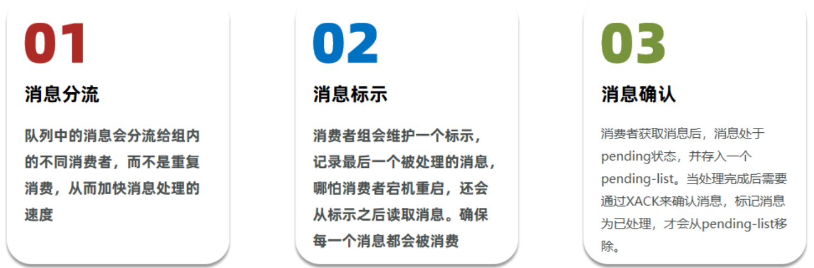

创建消费者组：


- `key`：队列名称
- `groupName`：消费者组名称
- `ID`：起始ID标识，$代表队列中最后一个消息，0代表队列中第一个消息
- `MKSTREAM`：队列不存在时自动创建队列

其他常见命令：


从消费者组读取消息：


- `group`：消费者组名称
- `consumer`：消费者名称，如果消费者不存在，会自动创建一个消费者
- `count`：本次查询的最大数量
- `BLOCK milliseconds`：当没有消息时最长等待时间
- `NOACK`：无需手动 ACK，获取到消息后自动确认
- `STREAMS key`：指定队列名称
- `ID`：获取消息的起始 ID：
  - “`>`”：从下一个未消费的消息开始
  - 其他：根据指定 id 从 pending-list 中获取已消费但未确认的消息，例如 0，是从 pending-list 中的第一个消息开始。

**消费者监听消息的基本思路：**


**总结**

`STREAM`类型消息队列的`XREADGROUP`命令特点

- 消息可回溯
- 可以多消费者争抢消息，加快消费速度
- 可以阻塞读取
- 没有消息漏读的风险
- 有消息确认机制，保证消息至少被消费一次

对比：


#### 7）基于Stream消息队列实现异步抢购秒杀券业务

需求：

- 创建一个 Stream 类型的消息队列，名为 `stream.orders`
- 修改之前的秒杀下单 Lua 脚本，在认定有抢购资格后，直接向 stream.orders 中添加消息，内容包含 `voucherId`、`userId`、`orderId`
- 项目启动时，开启一个线程任务，尝试获取 `stream.orders` 中的消息，完成下单

**通过命令行的方式创建消息队列以及消费者组**

```sh
XGROUP CREATE stream.orders g1 0 MKSTREAM 
```


- 最小值：12/s
- 最大值：565/s
- 平均值：110/s
- 吞吐量：`1577.3/s`


### 10、达人探店

#### 1）发布探店笔记

探店笔记类似点评网站的评价，往往是图文结合。对应的数据库表有两张：

- `tb_blog`：探店笔记表，包含笔记中的标题、文字、图片等
- `tb_blog_comments`：其他用户对探店笔记的评价

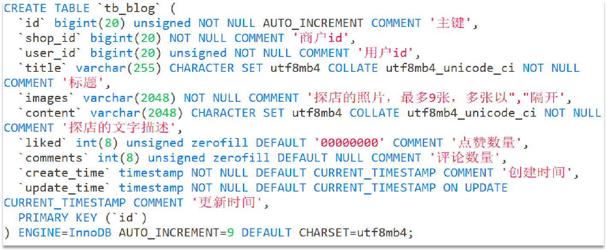

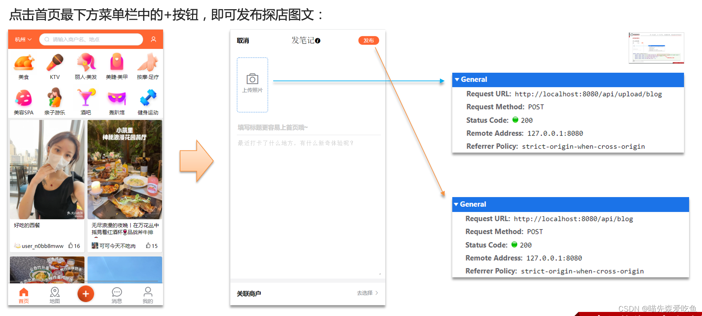

修改文件上传路径：

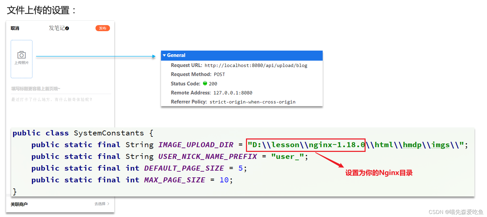

> 如果Nginx是安装在Linux虚拟机上，而项目是在本题，则需要实现从本地向远程服务器上传文件，需要使用SSh进行上传，
>
> **引入依赖**
>
> ```xml
> <!--java端连接ssh远程服务器-->
> <dependency>
>     <groupId>com.jcraft</groupId>
>     <artifactId>jsch</artifactId>
>     <version>0.1.55</version>
> </dependency>
> ```
>
> **工具类SSHUtils**
>
> ```java
> package com.hmdp.utils;
> 
> import com.jcraft.jsch.*;
> import org.slf4j.Logger;
> import org.slf4j.LoggerFactory;
> 
> import java.io.*;
> import java.util.ArrayList;
> import java.util.List;
> import java.util.Properties;
> 
> public class SSHUtils {
> 
>     private static final Logger LOGGER = LoggerFactory.getLogger(SSHUtils.class);
> 
>     private static final int SESSION_TIMEOUT = 30 * 10000000;
> 
> 
>     /**
>      * 创建一个ssh会话
>      * @param host 主机名
>      * @param port 端口
>      * @param userName 用户名
>      * @param password 密码
>      * @return Session
>      */
>     public static Session createSshSession(String host, int port ,String userName, String password){
>         // 创建jsch对象
>         JSch jsch = new JSch();
>         Session session = null;
>         // 创建session会话
>         try {
>             session = jsch.getSession(userName, host, port);
>             // 设置密码
>             session.setPassword(password);
>             // 创建一个session配置类
>             Properties sshConfig = new Properties();
>             // 跳过公钥检测
>             sshConfig.put("StrictHostKeyChecking", "no");
>             session.setConfig(sshConfig);
>             // 我们还可以设置timeout时间
>             session.setTimeout(SESSION_TIMEOUT);
>             // 建立连接
>             session.connect();
>         }
>         catch (Exception e){
>             e.printStackTrace();
>         }
>         return session;
>     }
> 
>     /**
>      * 执行远程命令
>      * @param session 会话
>      * @param cmd cmd命令，也可以是&&在一起的命令
>      * @return List<String>
>      */
>     public static List<String> executeCmd(Session session, String cmd) {
>         ChannelExec channelExec = null;
>         InputStream inputStream = null;
>         // 输出结果到字符串数组
>         List<String> resultLines = new ArrayList<>();
>         // 创建session会话
>         try {
>             // session建立之后，我们就可以执行shell命令，或者上传下载文件了,下面我来执行shell命令
>             channelExec = (ChannelExec) session.openChannel("exec");
>             // 将shell传入command
>             channelExec.setCommand(cmd);
>             // 开始执行
>             channelExec.connect();
>             // 获取执行结果的输入流
>             inputStream = channelExec.getInputStream();
>             String result = null;
>             BufferedReader in = new BufferedReader(new InputStreamReader(inputStream));
>             while ((result = in.readLine()) != null) {
>                 resultLines.add(result);
>                 LOGGER.info("命令返回信息：{}", result);
>             }
>         } catch (Exception e) {
>             LOGGER.error("Connect failed, {}", e.getMessage());
>             ArrayList<String> errorMsg = new ArrayList<>();
>             errorMsg.add(e.getMessage());
>             return errorMsg;
>         } finally {
>             // 释放资源
>             if (channelExec != null) {
>                 try {
>                     channelExec.disconnect();
>                 } catch (Exception e) {
>                     LOGGER.error("JSch channel disconnect error:", e);
>                 }
>             }
>             if (session != null) {
>                 try {
>                     session.disconnect();
>                 } catch (Exception e) {
>                     LOGGER.error("JSch session disconnect error:", e);
>                 }
>             }
>             if (inputStream != null) {
>                 try {
>                     inputStream.close();
>                 } catch (Exception e) {
>                     LOGGER.error("inputStream close error:", e);
>                 }
>             }
>         }
>         return resultLines;
>     }
> 
>     /**
>      * 向远端上传文件
>      * @param session 会话
>      * @param directory 上传的目录
>      * @param uploadFile 待上传的文件
>      * @param uploadFileName 上传到远端的文件名
>      */
>     public static void uploadFile(Session session,String directory,File uploadFile,String uploadFileName){
>         ChannelSftp channelSftp = null;
>         try {
>             channelSftp = (ChannelSftp) session.openChannel("sftp");
>             channelSftp.connect();
>             LOGGER.info("start upload channel file!");
>             channelSftp.cd(directory);
>             channelSftp.put(new FileInputStream(uploadFile), uploadFileName);
>             LOGGER.info("Upload Success!");
>         }
>         catch (Exception e){
>             e.printStackTrace();
>         } finally {
>             if (null != channelSftp){
>                 channelSftp.disconnect();
>                 LOGGER.info("end execute channel sftp!");
>             }
> 
>             if (session != null) {
>                 try {
>                     session.disconnect();
>                 } catch (Exception e) {
>                     LOGGER.error("JSch session disconnect error:", e);
>                 }
>             }
>         }
>     }
> 
>     public static void uploadFile(Session session,String directory,FileInputStream inputStream,String uploadFileName){
>         ChannelSftp channelSftp = null;
>         try {
>             if(uploadFileName.indexOf("/") == -1){
>                 return;
>             }
>             String[] fileSplit = uploadFileName.split("/");
>             if(fileSplit == null){
>                 return;
>             }
>             String fileName = fileSplit[fileSplit.length-1];
>             channelSftp = (ChannelSftp) session.openChannel("sftp");
>             channelSftp.connect();
>             LOGGER.info("start upload channel file!");
>             channelSftp.cd(directory);
>             for(int i = 0; i < fileSplit.length - 1; i++){
>                 if("".equals(fileSplit[i])){
>                     continue;
>                 }
>                 if(isDirExist(fileSplit[i] + "/", channelSftp)){
>                     channelSftp.cd(fileSplit[i]);
>                 } else {
>                 	// 这里要注意：通过 channelSftp.mkdir 来创建文件夹，只能一个一个创建，不能批量创建
>                     channelSftp.mkdir(fileSplit[i] + "");
>                     channelSftp.cd(fileSplit[i] + "");
>                 }
>             }
>             channelSftp.put(inputStream, fileName);
>             LOGGER.info("Upload Success!");
>         }
>         catch (Exception e){
>             e.printStackTrace();
>         } finally {
>             if (null != channelSftp){
>                 channelSftp.disconnect();
>                 LOGGER.info("end execute channel sftp!");
>             }
> 
>             if (session != null) {
>                 try {
>                     session.disconnect();
>                 } catch (Exception e) {
>                     LOGGER.error("JSch session disconnect error:", e);
>                 }
>             }
>         }
>     }
> 
>     /**
>      * 判断目录是否存在
>      */
>     public static boolean isDirExist(String directory, ChannelSftp sftp) {
>         boolean isDirExistFlag = false;
>         try {
>             SftpATTRS sftpATTRS = sftp.lstat(directory);
>             return sftpATTRS.isDir();
>         } catch (Exception e) {
>             if (e.getMessage().toLowerCase().equals("no such file")) {
>                 isDirExistFlag = false;
>             }
>         }
>         return isDirExistFlag;
>     }
> 
> 
>     /**
>      * 从远端下载文件
>      * @param session 会话
>      * @param directory 远端需要下载的目录
>      * @param savePathWithFileName 远端文件的路径包含文件名
>      * @param downloadFileName  下载到本地的远端文件名
>      */
>     public static void downloadFile(Session session, String directory,String savePathWithFileName,String downloadFileName) {
>         ChannelSftp channelSftp = null;
>         try {
>             channelSftp = (ChannelSftp) session.openChannel("sftp");
>             channelSftp.connect();
>             LOGGER.info("start download channel file!");
>             channelSftp.cd(directory);
>             File file = new File(savePathWithFileName);
>             channelSftp.get(downloadFileName, new FileOutputStream(file));
>             LOGGER.info("Download Success!");
>         }
>         catch (Exception e){
>             e.printStackTrace();
>         } finally {
>             if (null != channelSftp){
>                 channelSftp.disconnect();
>                 LOGGER.info("end execute channel sftp!");
>             }
> 
>             if (session != null) {
>                 try {
>                     session.disconnect();
>                 } catch (Exception e) {
>                     LOGGER.error("JSch session disconnect error:", e);
>                 }
>             }
>         }
>     }
> }
> ```
>
> **使用**
>
> ```java
> Session SSHSESSION = SSHUtils.createSshSession("ip地址", 22, "远程服务器用户名", "远程服务器密码");
>             SSHUtils.uploadFile(SSHSESSION, SystemConstants.IMAGE_UPLOAD_DIR ,inputStream, fileName)
> ```

#### 2）查询探店笔记

需求：点击首页的探店笔记，会进入详情页面，实现该页面的查询接口：

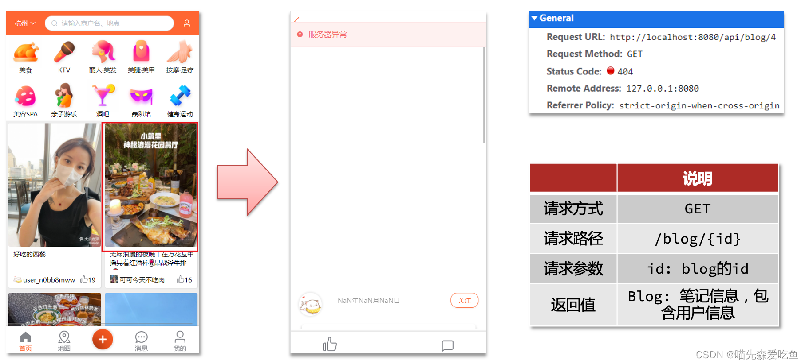

#### 3）点赞功能

需求：

- 同一个用户只能点赞一次，再次点击则取消点赞
- 如果当前用户已经点赞，则点赞按钮高亮显示（前端已实现，判断字段`Blog`类的`isLike`属性）

实现步骤：

- 给Blog类中添加一个`isLike`字段，表示当前用户是否点赞

- 修改点赞功能，使用Redis中的`Set`集合判断是否点赞过，未点赞过则点赞数+1，已点赞过则点赞数-1

  > 需要一个集合去记录所有点赞过的用户，同时一个用户只能点赞一次，要求用户id不能重复，即集合中的元素唯一 => `Set`

- 修改根据 id 查询 Blog 的业务，判断当前登录用户是否点赞过，赋值给`isLike`字段

- 修改分页查询Blog业务，判断当前登录用户是否点赞过，赋值给`isLike`字段

#### 4）点赞排行榜

在探店笔记的详情页面，应该把给该笔记点赞的人显示出来，比如最早点赞的 TOP5，形成点赞排行榜：

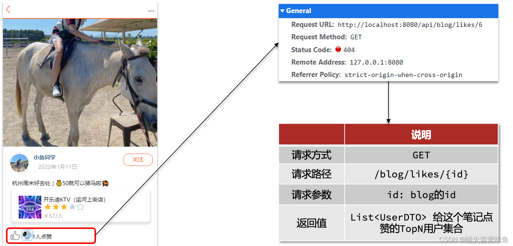

`Set`集合中的元素是无序的，点赞排行榜需要对点赞时间进行排序，此处`Set`集合并不满足需求

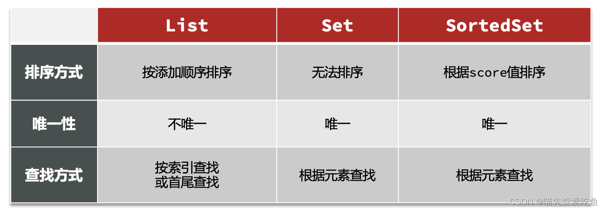

=> `SortedSet`更符合需求

- 通过`ZSCORE`命令获取 `SortedSet`中存储的元素的相关的 SCORE 值
- 通过`ZRANGE`命令获取指定范围内的元素

### 11、好友关注

#### 1）关注与取关

在探店图文的详情页中，可以关注发布笔记的作者：

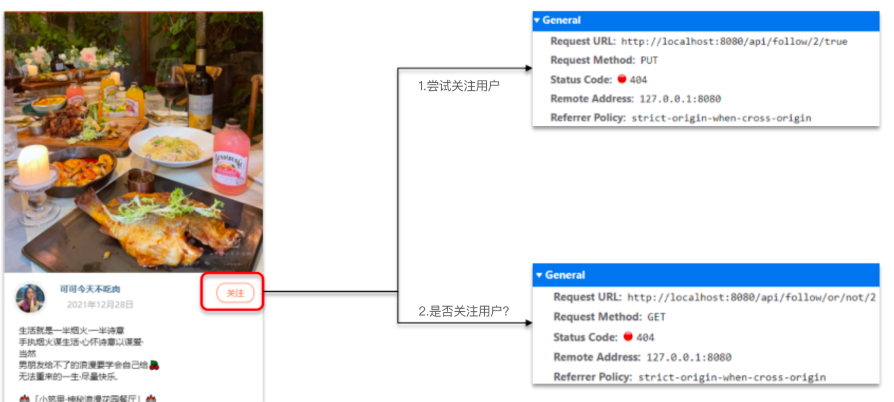

需求：基于该表数据结构，实现两个接口，

- 关注和取关接口
- 判断是否关注接口

关注和取消关注接口 实现思路：

- 获取当前登录用户
- 判断是否关注
  - 关注 => 新增
  - 取消关注 => 删除


#### 2）共同关注

想要去看共同关注的好友，需要首先进入到这个页面，这个页面会发起两个请求

- 去查询用户的详情
- 去查询用户的笔记


需求：

利用 Redis 中的 `set `类型的数据结构，实现共同关注功能（set 数据结构可以用来计算指定 key 之间元素的**交集**）。在博主个人页面展示出当前用户与博主的共同好友。

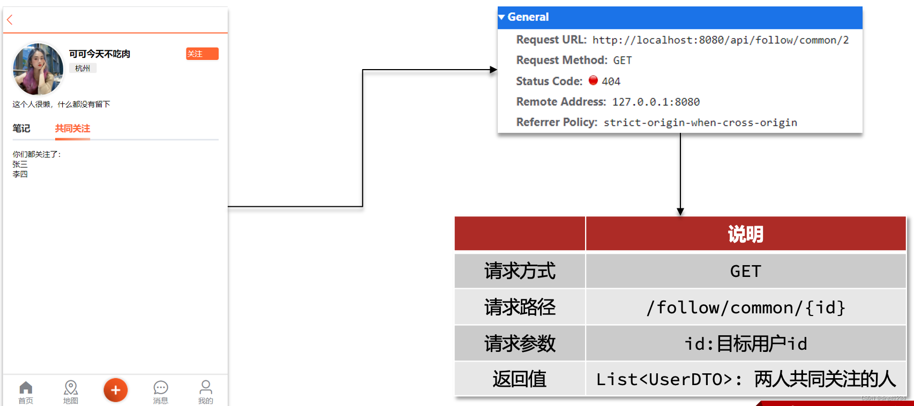


#### 3）关注推送

关注推送也叫作`Feed`流，直译为投喂，为用户持续的提供“沉浸式”的体验，通过无限下拉刷新获取新的消息。

`Feed`流产品有两种常见模式：

- `TimeLine`：不做内容筛选，简单的按照内容发布时间排序，常用语好友或关注。例如朋友圈
  - 优点：信息全面，不会有缺失，并且实现相对简单
  - 缺点：信息噪音较多，用户不一定感兴趣，内容获取效率低
- `智能排序`：利用智能算法屏蔽掉违规的、用户不感兴趣的内容，推送用户感兴趣的信息来吸引用户
  - 优点：投喂用户感兴趣信息，用户粘度很高，容易沉迷
  - 缺点：如果算法不精准，可能起到反作用

=>  本例中的个人页面，是基于关注的好友来做 Feed 流，因此采用 Timeline 的模式。该模式的实现方案有三种：

- 拉模式
- 推模式
- 推拉结合

**拉模式**：也叫做读扩散

假设有三个人，分别是张三、李四、王五，这三个人分别会在自己的账号发布自己的笔记或者视频，在这里我们统一称之为消息，这三个人发布的所有的消息都会被发送到发件箱中，发送到发件箱中的消息除了消息本身之外，还需要带有时间戳。粉丝赵六会有一个收件箱，平时收件箱是空的，只有他在读取消息时，才会把赵六关注的所有人的发件箱中的消息拉取到他的收件箱中，拉取到收件箱后，消息会按照携带的时间戳进行排序，然后赵六就可以读取消息了。

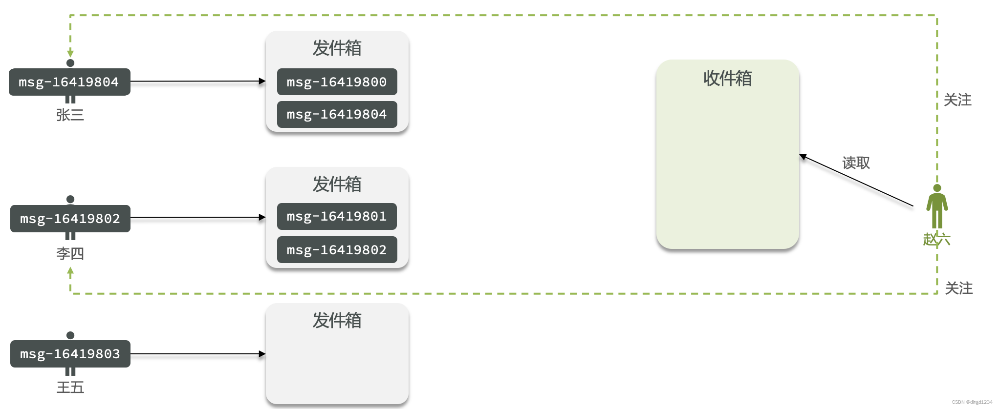


- 优点：节省内存空间。收件箱中的消息在读取完后就会被清空，下次需要读取的时候会重新从所有关注人的发件箱中拉取。消息只保存了一份。
-  缺点：每次读取消息都要重新拉取发件箱中的消息，然后再做排序，比较耗时。

**推模式**：也叫作写扩散

假设现在有两个 up 主：张三、李四，有三个粉丝：粉丝1、粉丝2、粉丝3，粉丝1关注了张三，粉丝2和3都关注了张三和李四，如果张三此时想要发送消息，那么这条消息会直接推送到张三的所有粉丝的收件箱中，而李四发送的消息也会被推送到粉丝2和3的收件箱中，收件箱收到消息后会对所有的消息进行排序，粉丝在读取消息时，就已经是排序好的消息了。这样的一个好处就是延时低，不必每次读取时都需要重新拉取消息。但这种方式内存占用会比较高，up 主每次发消息都要同步所有的粉丝，如果粉丝数过多，超过几百万，就需要复制几百万份。

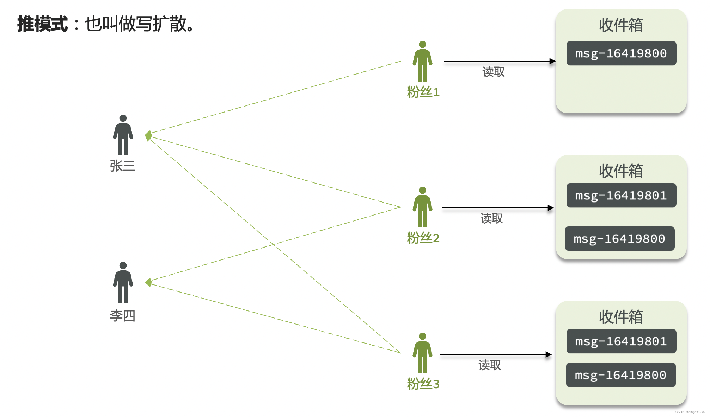

**推拉结合模式**：也叫作读写结合，兼具推和拉两种模式的优点

普通粉丝人数众多，但是活跃度较低，读取消息的频率也就低，可采用拉模式；
而活跃粉丝人数少，但是活跃度高，读取消息的频率高，可采用推模式。
大 V 发送消息时，会直接将消息推送到活跃粉丝的发件箱中，而针对于普通粉丝，消息会先发送到发件箱中，当普通粉丝读取消息时，会直接从发件箱中拉取。

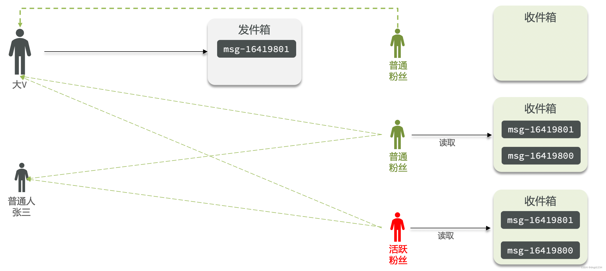


三种模式对比：

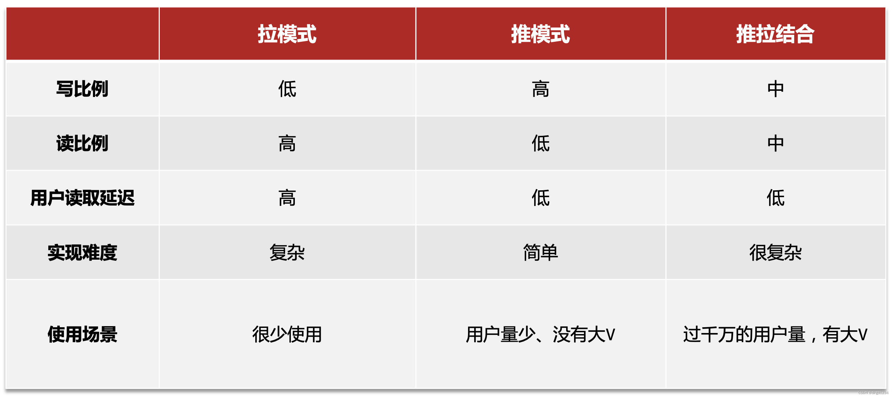

**基于推模式实现关注推送功能**

需求：

- 修改新增探店笔记的业务，在保存 Blog 到数据库的同时，推送到粉丝的收件箱
- 收件箱满足可以根据时间戳排序，必须用 Redis 的数据结构实现
- 查询收件箱数据时，可以实现分页查询

**需求分析：**

`Redis `中 `List`、`SortedSet `两种数据结构均可以实现排序功能。`List `要想实现按时间排序，可以按照插入顺序排。`SortedSet `排序则是按照 `score `进行排序，`score `值中可以存储时间戳来实现按照时间排序。

`Redis`中的 List `可以`按照角标进行查询，完全可以实现分页查询。而 `SortedSet `虽然没有角标，但是排序完成后，会有一个**排名机制**，可以使用排名机制进行查询，也能实现分页查询。

*那究竟应该选择哪种数据结构来分页查询功能呢？*

 **由于Feed 流中的数据会不断更新，这就导致数据的角标也在不断变化，因此不能采用传统的分页模式。**

传统分页模式：

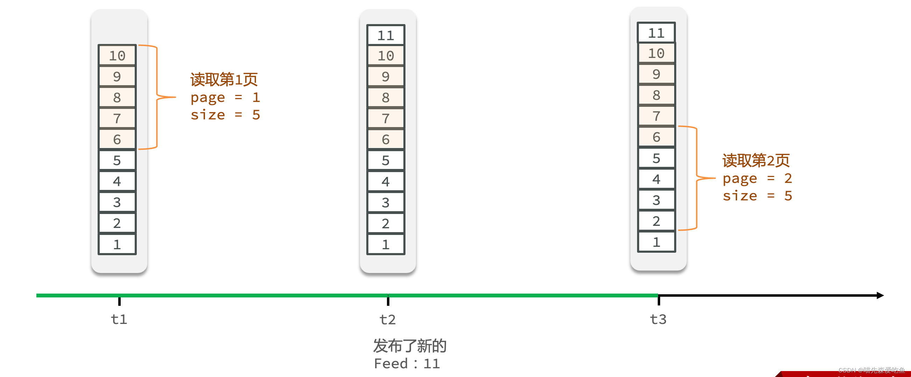

假设 t1 时刻，Feed 流中有 10 条消息，此时从 Feed 流中读取前 5 条消息，在 t2时刻向 Feed 流中插入了一条新消息，当在 t3 时刻再去读取后 5 条数据时，就会出现数据重复读取的问题。为了避免这种情况，可以采用滚动分页。所谓滚动分页，其实就是记录每一次查询的最后一条消息的下标，下一次查询时从该条消息开始查询。

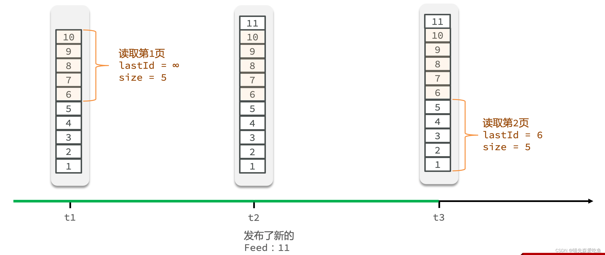


假设 t1 时刻，Feed 流中有 10 条消息，此时从 Feed 流中读取前 5 条消息，在 t2时刻向 Feed 流中插入了一条新消息，当在 t3 时刻再去读取后 5 条数据时，查询会从记录的 lastId 开始，向后查询 5 条，这样也就不会出现查询重复的问题。
SortedSet 除了可以按照时间戳排序，还支持按照 score 值的范围进行查询，即按照时间戳范围进行查询。**每次查询时，记录最小的时间戳，下次查询时，从比该时间戳还小的下一个时间戳开始查询。**

=>  为了保证发布的消息不会重复进入需要推送的粉丝的收件箱中，以及保证查询速度，使用 `SortedSet `更优。

#### 4）实现关注推送页面的分页查询

需求：在个人主页的”关注“卡片中，查询并展示推送的 Blog 信息：

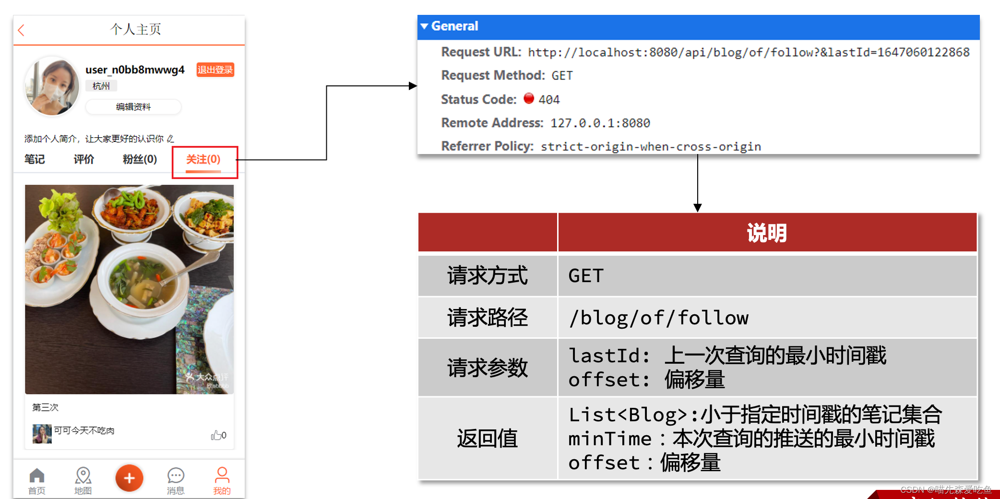

实现滚动分页需要使用下面的命令：

```sh
ZREVRANGEBYSCORE key max min [WITHSCORES] [LIMIT offset count]
```

返回有序集 key 中， score 值介于 max 和 min 之间(默认包括等于 max 或 min )的所有的成员。有序集成员按 score 值递减(从大到小)的次序排列。WITHSCORES 表示是否返回成员分数。LIMIT 表示是否分页，如果带有 LIMIT，则后面必须带有offset、count，offset表示偏移量（相对于max值而言），count 表示结果数量。

> 参考文章：[Redis有序集合命令ZREVRANGEBYSCORE详解与应用](https://blog.csdn.net/chwshuang/article/details/52834380)

注意：一旦使用分页查询后，max 以及 offset 的值就是一个动态变化的值了。其中，max 值是上一次查询结果中的最小分数（即时间戳）。而 offset 的取值也与上一次查询结果中的最小分数有关，如果上一次查询结果中的最小分数值重复多次出现，offset的值就应该为最小分数重复出现的次数。

如下图所示：其中 m7 和 m6的score值相同

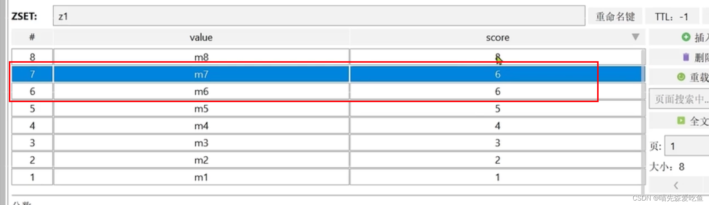

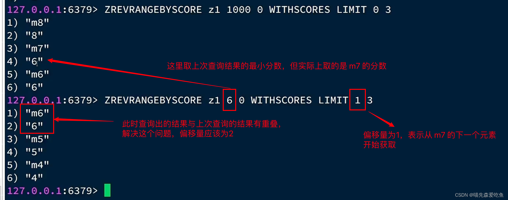

=> `offset`需要动态获取

定义滚动查询结果类 `ScrollResult`，统一返回结果：

```java
@Data
public class ScrollResult {
    private List<?> list;
    private Long minTime;
    private Integer offset;
}
```

### 12、附近商户

#### 1）GEO数据结构的基本用法

`GEO`就是`Geolocation`的简写形式，代表地理坐标。Redis在`3.2`版本中加入了对GEO的支持，允许存储地理坐标信息，帮助我们根据经纬度来检索数据。常见的命令有：

* `GEOADD`：添加一个地理空间信息，包含：经度（longitude）、纬度（latitude）、值（member）
* `GEODIST`：计算指定的两个点之间的距离并返回
* `GEOHASH`：将指定member的坐标转为hash字符串形式并返回
* `GEOPOS`：返回指定member的坐标
* `GEORADIUS`：指定圆心、半径，找到该圆内包含的所有member，并按照与圆心之间的距离排序后返回。6.以后已废弃
* `GEOSEARCH`：在指定范围内搜索member，并按照与指定点之间的距离排序后返回。范围可以是圆形或矩形。**6.2.新功能**
* `GEOSEARCHSTORE`：与GEOSEARCH功能一致，不过可以把结果存储到一个指定的key。 6.2.新功能

#### 2）举例

需求：

1. 添加下面几条数据：

   - 北京南站（116.378248 39.865275）

   - 北京站（116.42803 39.903738）

   - 北京西站（116.322287 39.893729）

2. 计算北京西站到北京站的距离

3. 搜索天安门（116.397904 39.909005）附近 10km 内的所有火车站，并按照距离升序排序

**GEOADD命令**

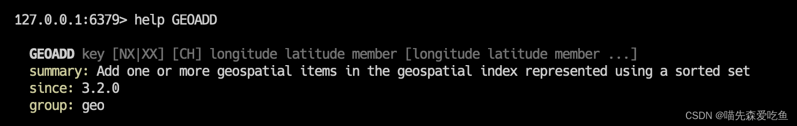

添加北京南站、北京站、北京西站的坐标数据

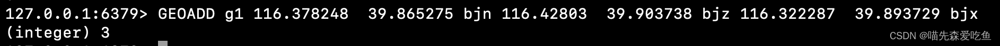

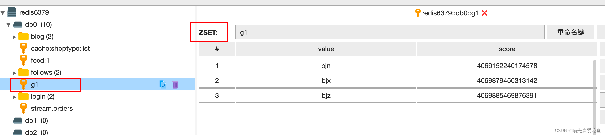

=> 可以看出 GEO 底层是基于 `SortedSet `实现的，Redis 将地理坐标转换成了 score 值存入到了 SortedSet 中。

**GEODIST命令**

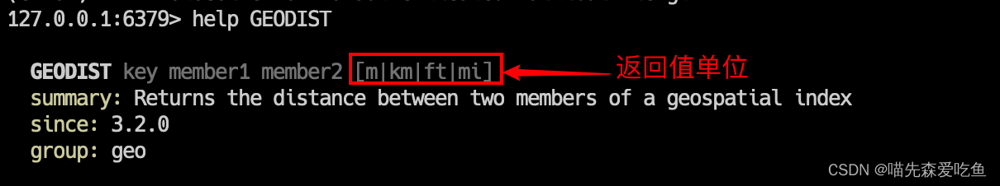

计算北京西站到北京站的距离


**GEORADIUS 命令（已废弃）**

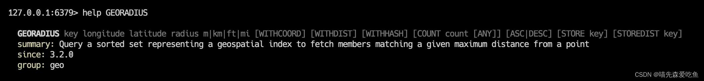

**GEOSEARCH 命令**

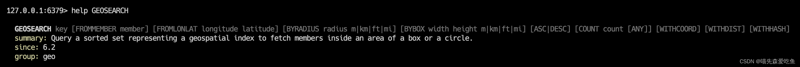

返回使用 `GEOADD `向 `SortedSet `中添加的 member，这些 member 位于给定形状指定的区域的边界内。该命令对`GEORADIUS`命令进行了扩展，除了支持在圆形区域内搜索外，它还支持在矩形区域内搜索。 

*应使用此命令代替已弃用的GEORADIUS和GEORADIUSBYMEMBER命令。*

1、查询的中心点由以下强制选项之一提供：

- FROMMEMBER: 使用给定的且存在于SortedSet中的 member 的位置。
- FROMLONLAT：使用给定的 longitude 和 latitude 位置。

2、查询的形状由以下强制选项之一提供：

- BYRADIUS: 类似GEORADIUS，根据给定的圆形区域内搜索 radius。
-  BYBOX：在轴对齐的矩形内搜索，由 height 和 width 确定

3、该命令可以选择使用以下选项返回附加信息：

- WITHDIST: 返回匹配项到指定中心点的距离。返回的距离单位与半径或高度和宽度参数指定的单位相同。
- WITHCOORD: 返回匹配项的经度和纬度。
- WITHHASH：以 52 位无符号整数的形式返回项目的原始 geohash 编码排序集分数。

4、默认情况下，匹配项未排序返回。要对它们进行排序，请使用以下两个选项之一：

- ASC：相对于中心点，从最近到最远对返回的项目进行排序。
-  DESC：相对于中心点，从最远到最近对返回的项目进行排序

5、默认返回所有匹配项。如果想要将结果限制为前 N 个匹配项，可以使用COUNT选项。使用ANY选项时，只要找到足够的匹配项，该命令就会返回。

搜索天安门（116.397904 39.909005）附近 10km 内的所有火车站，并按照距离升序排序

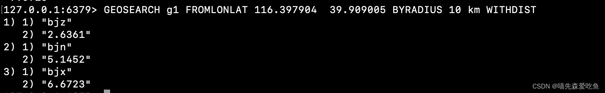

**GEOPOS 和 GEOHASH 命令：**

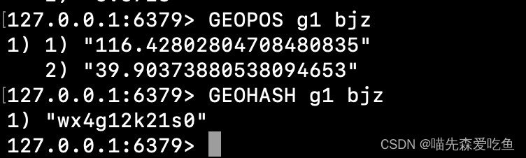

#### 3）导入店铺数据到GEO


将数据库表中的数据导入到redis中去，redis中的GEO，GEO在redis中就一个menber和一个经纬度，把x和y轴传入到redis做的经纬度位置去，但不能把所有的数据都放入到member中去，毕竟作为redis是一个内存级数据库，如果存海量数据，redis还是力不从心，所以在这个地方存储他的id即可。

问题：在redis中并没有存储type，所以无法根据type来对数据进行筛选

解决：按照商户类型做分组，类型相同的商户作为同一组，以typeId为key存入同一个GEO集合中即可


*此处可以写在一个任务中，或者测试类中*

### 13、用户签到

#### 1）BitMap的用法

假如我们用一张表来存储用户签到信息，其结构应该改如下：

```sql
-- ----------------------------
-- Table structure for tb_sign
-- ----------------------------
DROP TABLE IF EXISTS `tb_sign`;
CREATE TABLE `tb_sign`  (
  `id` bigint(20) UNSIGNED NOT NULL AUTO_INCREMENT COMMENT '主键',
  `user_id` bigint(20) UNSIGNED NOT NULL COMMENT '用户id',
  `year` year NOT NULL COMMENT '签到的年',
  `month` tinyint(2) NOT NULL COMMENT '签到的月',
  `date` date NOT NULL COMMENT '签到的日期',
  `is_backup` tinyint(1) UNSIGNED NULL DEFAULT NULL COMMENT '是否补签',
  PRIMARY KEY (`id`) USING BTREE
) ENGINE = InnoDB AUTO_INCREMENT = 1 CHARACTER SET = utf8mb4 COLLATE = utf8mb4_general_ci ROW_FORMAT = Compact;
-- ----------------------------
-- Records of tb_sign
-- ----------------------------
```

加入有1000万个用户，平均每人每年签到次数为 10 次，则这张表一年的数据量为 1 亿条。每签到一次需要使用（8 + 8 + 1 + 1 + 3 + 1）共 22 字节的内存，一个月则最少需要 600 多字节。显然，这种方式不合适。

**改进方案：**按月来统计用户签到信息，签到记录为 1，未签到则记录 0


将每一个 bit 位对应当月的每一天，形成了映射关系。用 0 和 1 表示业务状态，这种思路就成为[位图](https://so.csdn.net/so/search?q=位图&spm=1001.2101.3001.7020)（BitMap）。

Redis 中是利用 String 类型数据结构实现 BitMap，因此最大上限是 512M，转换为 bit 则是 2^32^ 个 bit 位。

BitMap的**操作命令**有：

* `SETBIT`：向指定位置（offset）存入一个0或1
* `GETBIT `：获取指定位置（offset）的bit值
* `BITCOUNT `：统计BitMap中值为1的bit位的数量
* `BITFIELD `：操作（查询、修改、自增）BitMap中bit数组中的指定位置（offset）的值
* `BITFIELD_RO `：获取BitMap中bit数组，并以十进制形式返回
* `BITOP `：将多个BitMap的结果做位运算（与 、或、异或）
* `BITPOS `：查找bit数组中指定范围内第一个0或1出现的位置

#### 2）举例

注意 offset 从 0 开始1

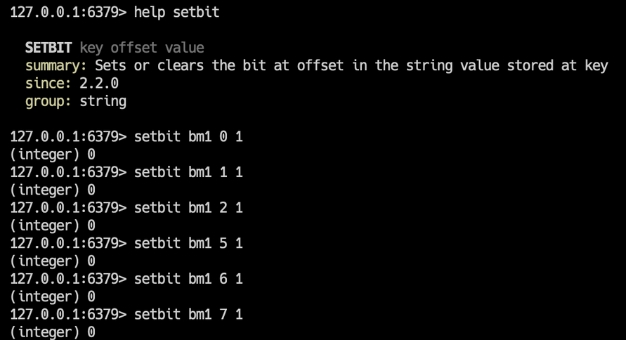

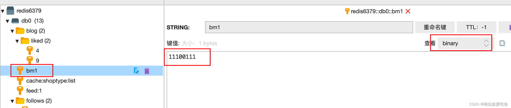

1、获取第三天的签到数据

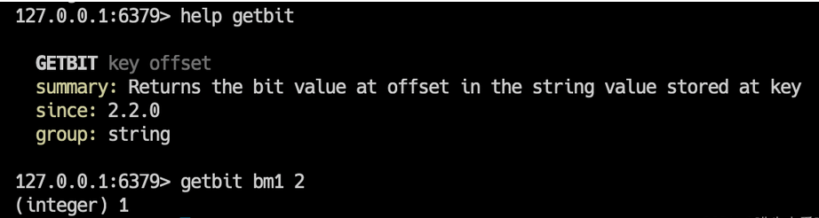

2、获取总的签到次数

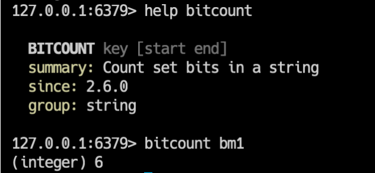

3、使用 BITFIELD 命令获取数据：从 0 号位开始获取两个 bit 位

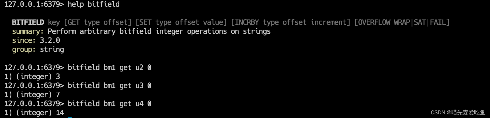

`type`表示类型参数：当被设置的二进制位范围值为整数时，用户可以在类型参数的前面添加 i 来表示有符号整数，或者使用 u 来表示无符号整数。比如说，我们可以使用 u8 来表示 8 位长的无符号整数，也可以使用 i16 来表示 16 位长的有符号整数。

4、查找 bit 数组中指定范围内第一个 0 或 1 出现的位置：

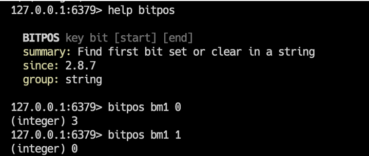

#### 3）签到功能

需求：实现签到接口，将当前用户当天签到信息保存到Redis中


**思路**：我们可以把年和月作为bitMap的key，然后保存到一个bitMap中，每次签到就到对应的位上把数字从0变成1，只要对应是1，就表明说明这一天已经签到了，反之则没有签到。

`Postman`测试

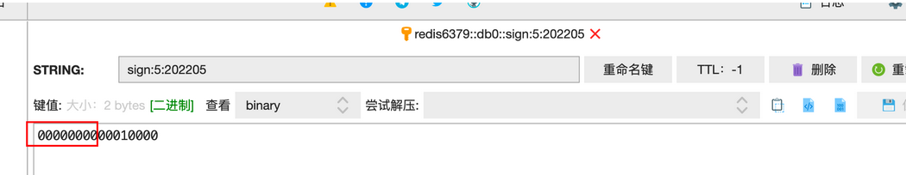

存入的数据总共 16 个bit，即数据在存储是字节的形式存储的，1字节=8 bit，不足 8 位的以 0 补足。


#### 3）签到统计

**问题 1：** 什么叫做连续签到天数？
 从最后一次签到开始向前统计，直到遇到第一次未签到位置，计算总的签到次数，就是连续签到天数。

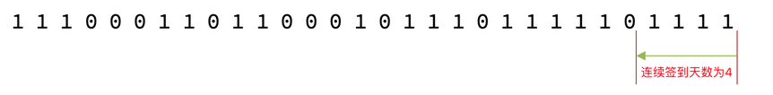

**问题 2：** 如何得到本月到今天为止的所有签到数据？
 使用命令：`BITFIELD key GET u[dayOfMonth] 0` 从 0 开始查询，到 dayOfMonth 截止

**问题 3：** 如何从后向前遍历每个 bit 位？
 与 1 做与运算，就能得到最后一个 bit 位。任何一个二进制数与 1 做与运算，结果就是这个数本身。随后右移一位，下一个 bit 位就成为了最后一个 bit 位，然后再与 1 做与远算，以此类推。


需求：实现下面接口，统计当前用户截止当前时间在本月的连续签到天数


*以命令形式修改签到数据*

`Postman`测试

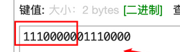


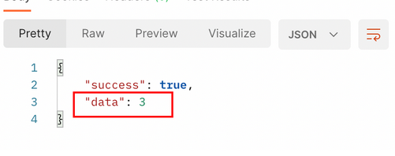


#### 4）关于使用BitMap解决缓存穿透的方案

> **缓存穿透**：
>
> 发起了一个数据库不存在的，redis里边也不存在的数据，通常你可以把他看成一个攻击
>
> **解决方案：**
>
> * 判断id<0
> * 如果数据库是空，那么就可以直接往redis里边把这个空数据缓存起来
>
> **遇到的问题**
>
> - 如果用户访问的是id不存在的数据，则此时就无法生效
> - 如果是不同的id那就可以防止下次过来直击数据

=> 解决：

可以将数据库的数据，所对应的id写入到一个list集合中，当用户过来访问的时候，我们直接去判断list中是否包含当前的要查询的数据，如果说用户要查询的id数据并不在list集合中，则直接返回，如果list中包含对应查询的id数据，则说明不是一次缓存穿透数据，则直接放行。


**问题：**主键非常长，采用以上方案，这个list也会很大

=> 可以使用`BitMap`来减少List的存储空间

我们可以把list数据抽象成一个非常大的bitmap，我们不再使用list，而是将db中的id数据利用哈希思想，比如：

`id % bitmap.size`  = > 算出当前这个id对应应该落在bitmap的那个索引上，然后将这个值从0变成1，然后当用户来查询数据时，此时已经没有了list，让用户用他查询的id去用相同的哈希算法， 算出来当前这个id应当落在bitmap的哪一位，然后判断这一位是0，还是1，如果是0则表明这一位上的数据一定不存在，  采用这种方式来处理，需要重点考虑一个事情，就是误差率，所谓的误差率就是指当发生哈希冲突的时候，产生的误差。


**思想类似于 Bloom FIlter**


### 13、UV统计

#### 1）HyperLogLog用法

- UV：全称 Unique Visitor，也叫独立访客量，是指通过互联网访问、浏览这个网页的自然人、1 天内同一个用户多次访问该网站，只记录 1 次。
- PV：全称 Page View，也叫页面访问量或点击量，用户每访问网站的一个页面，记录一次 PV，用户多次打开页面，则记录多次 PV。往往用来衡量网站的流量。

UV 统计在服务端做会比较麻烦，因为要判断该用户是否已经统计过了，需要将统计过的用户信息保存。但是如果每个访问的用户都保存到Redis 中，数据量会非常恐怖。

Hyperloglog(HLL)是从Loglog算法派生的概率算法，用于确定非常大的集合的基数，而不需要存储其所有值。相关算法原理大家可以参考：[HyperLogLog 算法的原理讲解以及 Redis 是如何应用它的](https://juejin.cn/post/6844903785744056333#heading-0)
Redis中的HLL是基于string结构实现的，单个HLL的内存**永远小于16kb**，**内存占用低**的令人发指！作为代价，其测量结果是概率性的，**有小于0.81％的误差**。不过对于UV统计来说，这完全可以忽略。


插入100W条数据测试：

- 数据统计情况

  插入 997593 条，损失2407条，误差率0.24%

- 内存占用情况

  > ```sh
  > info memory # 查看Redis内存占用情况
  > ```

  插入前：2352441

  插入后：2367392

  数据大小：14.6KB
